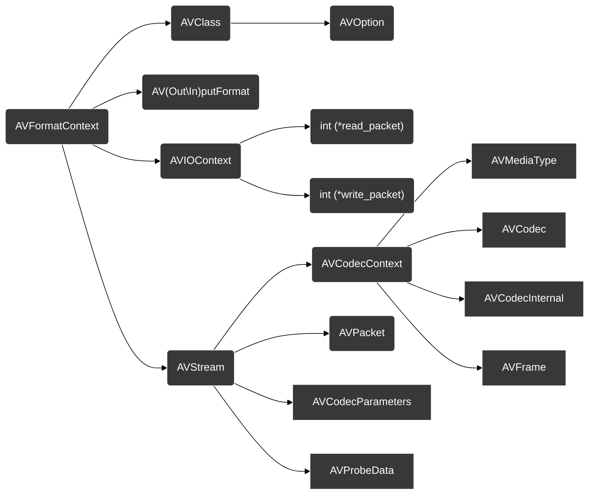
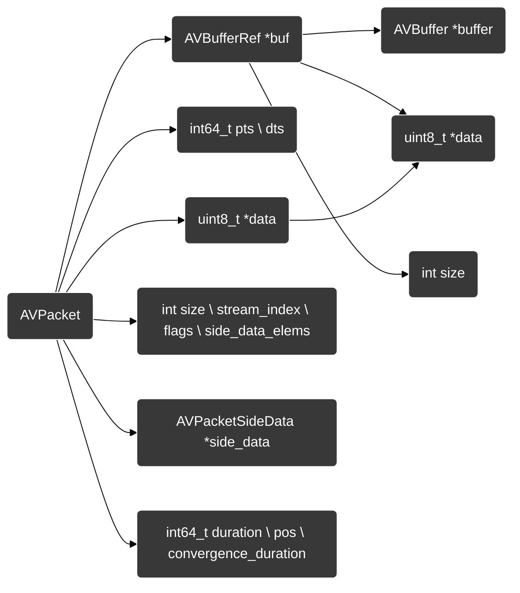
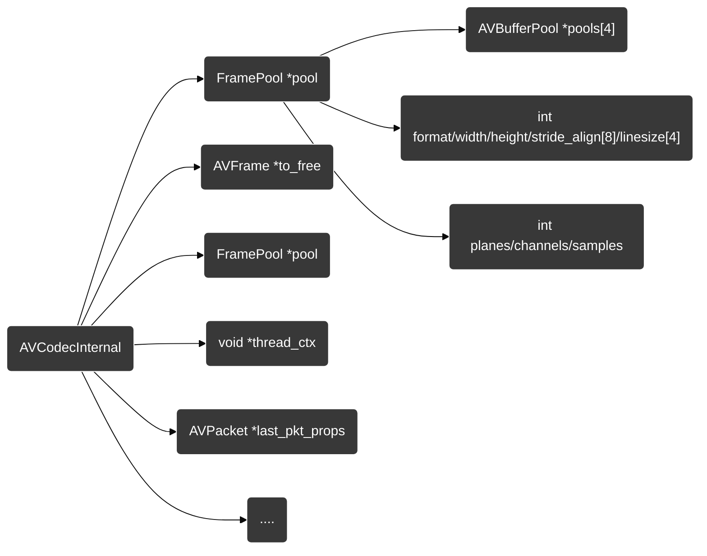
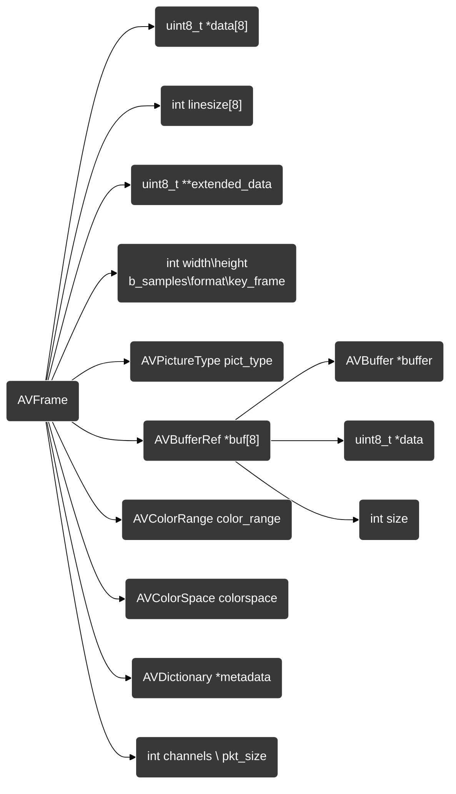

[toc]

## 前言

本文只是分析FFmpeg执行流程并不具有教学意义，都是以笔记形式记录，所得结论并不严谨，教学系列原理找官网。

面向源码学习FFmpeg框架：

1. 为了方便调用ffmpeg api需要使用静态编译ffmpeg，一般开发大多数都是动态库为了节省应用内存，也有全静态的场景（嵌入式设备），就静态库`	build/lib/libavcodec.a`而言大小就有`300+M`

2. 编译后的头文件、动态库都放在源代码工作路径，方便管理，但是需要手动的添加头文件、链接库、动态\静态链接执行库。

觉得麻烦可以直接将`make install`安装到默认用户环境目录下,在下面脚本中去掉`--prefix=$(pwd)/build \`参数就可以了。


## 编译便于调试、学习、分析ffmpeg、模块共享库

该脚本编译模块库为静态库，ffmpeg为静态链接，使用版本：4.2.2。仅适用于学习、调试FFmpeg API

```bash
#!/bin/bash
ScriptVersion="1.0"

unset file
unset directory

ff_version="ffmpeg-4.2.2"
ff="${ff_version}.tar.bz2"

static=1
shared=0

main(){
	confirmation_info
	download_ffmpeg
	if [ "$static" == "1" ];then
		fetch_x264_static
	elif [ "$shared" == "1" ];then
		#Install x264 x265 depend(shared library)
		#apt install libx264-dev libx265-dev
		read -p "Are you already installed libx264-dev?[Y/n]" ok
		if [ "$ok" == "n" ];then exit;fi
	else
		exit
	fi
	build_ff
}

confirmation_info(){
	local tips="Static"
	if [ "$static" == "1" ];then
		tips="Static"
	elif [ "$shared" == "1" ];then
		tips="Dynamic"
	fi
	echo -e "\033[31m${tips} compilation will be used. continue?[Y/n]\033[0m"
	read ok
	if [ "$ok" == "n" ];then 
		echo -e "\033[31mTry --help\033[0m"
		exit
	fi
}


download_ffmpeg(){
	pushd $HOME
	if [ ! -d $ff_version ];then
		if [ ! -f "$ff" ];then wget https://ffmpeg.org/releases/$ff;fi
		tar -xjvf $ff
	fi
	popd

	pushd $HOME/$ff_version
	if [ -f "Changelog" ];then
		rm Changelog *.md COPYING.* CREDITS MAINTAINERS RELEASE* VERSION
	fi
	popd
}

build_ff(){
	pushd $HOME/$ff_version

	local ret=$(find . -name "*.o")
	if [ -n "$ret" ];then
		echo "make clean..."
		make -j16 clean
	fi

	if [ "$static" == "1" ];then
		confg_static
	elif [ "$shared" == "1" ];then
		confg_shared
	fi

	make -j16 && make install
	popd
}


confg_static(){
# 如果开启了libx265 则需要开启--pkg-config-flags="--static".
	./configure \
		--prefix=$(pwd)/build \
		--extra-cflags="-static -I${HOME}/${x264_version}/build/include" \
		--extra-ldflags="-static -L${HOME}/${x264_version}/build/lib -lx264" \
		--enable-small \
		--disable-doc --disable-htmlpages --disable-manpages --disable-podpages --disable-txtpages \
		--disable-ffplay --disable-ffprobe \
		--disable-avdevice --disable-swresample --disable-postproc \
		--disable-network \
		--disable-asm --disable-mmx --disable-sse --disable-avx --disable-vfp --disable-neon --disable-inline-asm --disable-x86asm --disable-mipsdsp \
		--enable-debug=3 --disable-optimizations --ignore-tests=TESTS \
		--enable-gpl --enable-libx264
}

fetch_x264_static(){
	x264_version="x264-master"
	x264="x264-master.tar.bz2"
	pushd $HOME

	if [ ! -d "$x264_version" ];then
		if [ ! -f "$x264" ];then wget https://code.videolan.org/videolan/x264/-/archive/master/x264-master.tar.bz2;fi
		tar -xjvf $x264
	fi

	cd $x264_version
	if [ ! -f "./build/lib/libx264.a" ];then
		./configure --enable-static --disable-asm --prefix=$(pwd)/build --disable-opencl
		make -j16 && make install
	fi
	popd
}


confg_shared(){
#使用动态库：
#1.删除 --extra-cflags="-static" --extra-ldflags="-static" \
#2.添加 --enable-shared \

	./configure \
		--prefix=$(pwd)/build \
		--enable-shared \
		--enable-small \
		--disable-doc --disable-htmlpages --disable-manpages --disable-podpages --disable-txtpages \
		--disable-ffplay --disable-ffprobe \
		--disable-avdevice --disable-swresample --disable-postproc \
		--disable-network \
		--disable-asm --disable-mmx --disable-sse --disable-avx --disable-vfp --disable-neon --disable-inline-asm --disable-x86asm --disable-mipsdsp \
		--enable-debug=3 --disable-optimizations --ignore-tests=TESTS
		--enable-gpl --enable-libx264 #--enable-libx265 
}

usage (){
  echo "Usage :  $(basename "$0") [options] [--] argument-1 argument-2

  Options:
  -h, --help                  Display this message
  -d, --debug                 Debug model run
  -p, --posix                 Posix model parse shell command
  -v, --version               Display script version
  -f, --file FILE             Target file 
  -D, --directory DIRECTORY   Target directory
  --static                    Static compilation ffmpeg components and static link(default)
  --shared                    Dynamic compilation ffmpeg components and dynamic link
  --build_ffmpeg              Separate compilation ffmpeg"
}

while getopts ":hdpvf:D:-:" opt; do
  case "${opt}" in
    h) usage && exit 0;;
    d) set -x ;;
    p) set -o posix ;;
    v) echo "$0 -- Version $ScriptVersion"; exit ;;
    f) file=${OPTARG};;
    D) directory=${OPTARG};;
    -) case "${OPTARG}" in
         help) usage && exit 0;;
         debug)      set -x ;;
         posix)      set -o posix ;;
         version)    echo "$0 -- Version $ScriptVersion"; exit ;;
         file)       file=${!OPTIND}; OPTIND=$((OPTIND+1));;
         directory)  directory=${!OPTIND}; OPTIND=$((OPTIND+1));;
         static)     static=1;shared=0;;
         shared)     shared=1;static=0;;
         build_ffmpeg)build_ff ;exit;;
         *)          echo "Invalid option: --${OPTARG}" >&2 && exit 1;;
       esac;;
    :) echo "Option -${OPTARG} requires an argument." >&2 && exit 1;;
    *) echo "Invalid option: -${OPTARG}" >&2 && exit 1;;
  esac
done
shift $((OPTIND-1))

main "$@"
```

过程大概3-4分钟。脚本工作：

1. 下载ffmpeg4.2.2源码配置静态编译库、ffmpeg静态链接库
2. 下载libx264源码，静态编译出`libx264.a`
3. ffmpeg会链接到`libx264.a`，编译出来的静态库在ffmpeg源代码根目录下的`build`文件夹，编译出来的`libx264.a`也在x264-master源代码目录下的`build`文件夹

> 最后把这x264-master/build文件夹里面的静态库放在ffmpeg-4.2.2/build目录下就可以作为头文件、链接目录了。
>
> 把静态库编译在源码目录这样做的原因是方便移植、修改（对编译链接不熟悉的直接放在系统目录就ok了）


将build目录移到自己的源代码目录下，为了区分动态库目录我这里将build目录名字改为了static

测试代码如下`demo.cpp`:(源代码目录下应该有一个input.mov视频)

```c++
#include <iostream>

extern "C" {
#include "libavformat/avformat.h"
}

using std::string;;

int main(int argc, char *argv[]){
    AVFormatContext *ps = nullptr;
    string url = "input.mov";
  
    if(avformat_open_input(&ps, url.c_str(), nullptr, nullptr) < 0){
 			std::cerr << "File " << url << " parse failed" << std::endl;
      return -1;
    }
    return 0;
}
```

然后编译程序：

```bash
$ g++ demo.cpp -I static/include -L static/lib -lavfilter -lavformat -lavcodec -lavutil -lswscale -lz -lx264 -static -g
```

> -z 是额外的系统静态库，因为ffmpeg在某些函数(libavformat/mov.c中引用了uncompress函数)中依赖的libz.a库
>
> 这里需要引用你编译的所有子模块静态库，ffmpeg中的子模块依赖性很强，且最好是按照上面的顺序来链接，不然也会出错！

这样编译出来的`a.out`就是一个静态链接、使用静态库的可执行文件文件，在调试代码时候可以进入到ffmpeg-API中进行调试。（不一定非要静态链接，只要是静态库就可以，默认configure就是静态库+动态链接也是可以直接调试源码的）


**补充下调用ffmpeg动态库的编译(可选)：**

如果你将ffmpeg的模块库编译为动态库，那么就可以执行下面的编译：

```bash
$ g++ demo.cpp -I shread/include/ -L shread/lib/ -lavformat
```

- 这里只指定了一个`avformat`库是因为我指定了动态库目录，ld链接器会在该库下面寻找`avformat`依赖的其他库

设置工作目录下的动态库文件目录（这里不执行会发生运行报错，动态库是在程序运行时调用的）

> 一个动态库成功的使用包括3步：
>
> 1. 成功编译
> 2. 成功链接
> 3. 成功调用

```bash
$ export LD_LIBRARY_PATH="./build/lib"
```


**使用MakeFile**

这里不需要使用静态链接，因为会编译很慢，只要库文件是静态库就没问题

```makefile
CC:=g++
BIN:=a.out
CPPFLAGS:=-g -Wall -std=c++11 -I static/include
LIBS=-L static/lib/ -lavfilter -lavformat -lavcodec -lavutil -lswscale -lz -lx264
SRC:=$(wildcard *.cpp)
OBJS:=$(patsubst %.cpp,%.o,$(SRC))

$(BIN):$(OBJS)
	$(CC) $^ -o $@ $(LIBS)

clean:
	rm $(BIN) *.o output.* divide.* *.yuv *.h264
```


## 调用API-获取MOV文件信息

源代码如下：

```cpp
#include <iostream>

extern "C" {
#include "libavformat/avformat.h"
}

#define INPUT_FILE "input.mov"
using std::string;

int main(int argc, char *argv[]) {

  int status = -1;

  AVFormatContext *ps = nullptr;
  string url = INPUT_FILE;

  // 1. Open the input file
  status = avformat_open_input(&ps, url.c_str(), nullptr, nullptr);
  if (status != 0) {
    std::cerr << "File " + url + " parse failed" << std::endl;
    return -1;
  }

  // 2. Retrieve stream information
  status = avformat_find_stream_info(ps, nullptr);
  if (status != 0) {
    std::cerr << "Stream find info failed" << std::endl;
    return -1;
  }

  int index = 0;
  int is_output = 0;

  // 3. Print format and stream information
  av_dump_format(ps, index, url.c_str(), is_output);

  // 4. Close the input file IO
  avformat_close_input(&ps);

  return 0;
}
```


FFmpeg框架中最核心的结构体：`AVFormatContext`下面的每个函数执行流程都是基于它来进行操作。




本文中解码中重要的结构体:




AVCodecInternal 用于保存编解码器内部状态,`AVCodecInternalPool` 结构体中，`frames` 是一个数组，用于存储 `AVFrame` 结构体的指针，表示缓冲池中的帧。`count` 表示缓冲池中的帧数，`first_unused` 表示第一个未被使用的帧的下标。`alloc_count` 表示缓冲池中已经分配的帧数，`frame_size` 表示每帧数据的大小（字节数），`pool_size` 表示缓冲池的最大帧数，`refcounted` 表示帧是否支持多线程访问（是否使用引用计数）。






### 1.avformat_open_input分析

`libavformat/utils.c`文件函数定义:

```c
int avformat_open_input(AVFormatContext **ps, const char *url, AVInputFormat *fmt, AVDictionary **options);
/*
`ps`：指向`AVFormatContext`结构体指针的指针。`AVFormatContext`是一个媒体文件的容器，它包含了媒体文件的所有信息，如音频、视频、字幕等的流信息、文件格式信息、封装格式等。
`url`：输入文件的URL地址。
`fmt`：强制指定输入文件格式。如果设置为NULL，则该函数将自动检测输入文件的格式。
`options`：指向指向`AVDictionary`结构体指针的指针，它用于传递额外的选项。*/
```


- 初始化`AVFormatContext`结构体、初始化`ID3v2ExtraMeta`结构体

```c
gef➤  pt ID3v2ExtraMeta
type = struct ID3v2ExtraMeta {
    const char *tag;
    void *data;
    struct ID3v2ExtraMeta *next;
}
```

- 调用avformat_alloc_context来开辟大小为AVFormatContext结构体的内存空间

```c
545	     if (!s && !(s = avformat_alloc_context()))
```

- 如果指定了输入文件格式（即`fmt`不为NULL），则尝试将其作为输入格式。

```c
551	     if (fmt)
552	         s->iformat = fmt;
```

- 初始化字典（`AVDictionary`）选项。

```c
560	     if ((ret = av_opt_set_dict(s, &tmp)) < 0)
```

- 打开输入文件，读取并解析文件头，获取文件格式信息。

```c
573	     if ((ret = init_input(s, filename, &tmp)) < 0)
static int init_input(){
	420	     AVProbeData pd = { filename, NULL, 0 };
}
```

- 匹配文件名字是否处于白名单,也就是该文件后缀是否可用于分析

```c
593	     if (s->format_whitelist && av_match_list(s->iformat->name, s->format_whitelist, ',') <= 0) {
594	         av_log(s, AV_LOG_ERROR, "Format not on whitelist \'%s\'\n", s->format_whitelist);
```

- 设置 private data

```c
613	     if (!(s->priv_data = av_mallocz(s->iformat->priv_data_size)))
620	        if ((ret = av_opt_set_dict(s->priv_data, &tmp)) <0) //av_opt_set_dict用于设置输入文件的 AVFormatContext 对象的一个属性
```

- 获取文件metadata

```c
627	         ff_id3v2_read_dict(s->pb, &s->internal->id3v2_meta, ID3v2_DEFAULT_MAGIC, &id3v2_extra_meta);
631	         if ((ret = s->iformat->read_header(s)) < 0)
```

- 将一个 AVPacket 对象中的附加图片数据加入 AVFormatContext 结构体的 attached_pic 队列中。

> 这个队列用于存储音视频文件中的所有附加图片数据，可以在编码时自动将这些图片数据写入文件

```c
661	     if ((ret = avformat_queue_attached_pictures(s)) < 0)
//avformat_queue_attached_pictures 函数是 FFmpeg 中 AVFormatContext 结构体的一个成员函数
```

- 填充AVFormatContext结构体数据

```c
667	     s->internal->raw_packet_buffer_remaining_size = RAW_PACKET_BUFFER_SIZE;
```

- 查找并打开相应的解码器，将解码器与输入流相关联。

> 这里的 s->nb_streams -> 1音频流、0视频流、3字幕流

```c
671	     for (i = 0; i < s->nb_streams; i++)
672	         s->streams[i]->internal->orig_codec_id = s->streams[i]->codecpar->codec_id;
```

- 初始化完成`AVFormatContext`结构体。

```c
678      *ps = s;
679	     return 0;
```


### 2.avformat_find_stream_info分析

`libavformat/utils.c`文件函数定义:

```c
int avformat_find_stream_info(AVFormatContext *ic, AVDictionary **options)
/*
`ic`：指向`AVFormatContext`结构体指针的指针。`AVFormatContext`是一个媒体文件的容器，它包含了媒体文件的所有信息，如音频、视频、字幕等的流信息、文件格式信息、封装格式等。
*/
```

此时`AVFormatContext *ic`结构体内存（部分重要成员）如下：

> 该函数以及经过avformat_open_input结构体进行初始化了，所以会有数据

```c
gef➤  p *ic
$2 = {
  av_class = 0x562861024e20 <av_format_context_class>,
  iformat = 0x562861083540 <ff_mov_demuxer>,
  oformat = 0x0,
  priv_data = 0x5628634e7740,
  pb = 0x5628634ef750,
  ctx_flags = 0x0,
  nb_streams = 0x2,
  streams = 0x5628634e7c80,
  filename = "input.mov", '\000' <repeats 1014 times>,
  url = 0x5628634e7540 "input.mov",
  start_time = 0x8000000000000000,
  duration = 0x209f90,
  bit_rate = 0x0,
  packet_size = 0x0,
  max_delay = 0xffffffff,
  flags = 0x200000,
  probesize = 0x4c4b40,
  max_analyze_duration = 0x0,
  video_codec_id = AV_CODEC_ID_NONE,
  audio_codec_id = AV_CODEC_ID_NONE,
  subtitle_codec_id = AV_CODEC_ID_NONE,
  max_index_size = 0x100000,
  metadata = 0x5628634e7900,
  video_codec = 0x0,
  audio_codec = 0x0,
  subtitle_codec = 0x0,
  data_codec = 0x0,
  protocol_whitelist = 0x5628634e7720 "file,crypto",
  io_open = 0x5628607eee2a <io_open_default>,
  io_close = 0x5628607eee1e <io_close_default>,
  protocol_blacklist = 0x0,
}
```


- 媒体文件中是否存在丢失的流，即媒体文件中定义了但未实际存在的流。如果`missing_streams`不为空，它将指向一个整型数组，其中每个元素代表一个丢失的流的索引。

> 例如转码或合并多个媒体文件时，如果存在丢失的流，通常需要进行处理，以免影响后续的操作。

```c
   3583	     int *missing_streams = av_opt_ptr(ic->iformat->priv_class, ic->priv_data, "missing_streams");
```


- 获取`max_analyze_duration`，用于设置媒体文件探测流的最大持续时间。

>这里的AV_TIME_BASE=1000000 也就是1秒，flv文件那么探测时间为90秒

```c
   3591	     if (!max_analyze_duration) {
   3592	         max_stream_analyze_duration =
   3593	         max_analyze_duration        = 5*AV_TIME_BASE;
   3594	         max_subtitle_analyze_duration = 30*AV_TIME_BASE;
 → 3595	         if (!strcmp(ic->iformat->name, "flv"))
   3596	             max_stream_analyze_duration = 90*AV_TIME_BASE;
   3597	         if (!strcmp(ic->iformat->name, "mpeg") || !strcmp(ic->iformat->name, "mpegts"))
   3598	             max_stream_analyze_duration = 7*AV_TIME_BASE;
   3599	     }
```


- `avio_tell()`函数用于获取当前的读取位置，`ic->pb->bytes_read`表示已经读取的字节数，`ic->pb->seek_count`表示执行的寻址次数，`count`表示读取的帧数。记录程序运行信息

```c
   3601	     if (ic->pb)
   3602	         av_log(ic, AV_LOG_DEBUG, "Before avformat_find_stream_info() pos: %"PRId64" bytes read:%"PRId64" seeks:%d nb_streams:%d\n",
   3603	                avio_tell(ic->pb), ic->pb->bytes_read, ic->pb->seek_count, ic->nb_streams);
```


- 对输入文件的每个数据流进行遍历

> 一般来说解封装一个正常的mov文件ic->nb_streams会为3，其中:
>
> - ic->nb_streams[0] 为视频流
> - ic->nb_streams[1] 为音频流
> - ic->nb_streams[2] 为字幕流
>
> 我这里没有字幕流，所以ic->nb_streams:2，这里会循环2遍，第一遍视频流，第二遍音频流。

```c
//3605行
		for (i = 0; i < ic->nb_streams; i++) {
        const AVCodec *codec;
        AVDictionary *thread_opt = NULL;
        st = ic->streams[i];					//获取该数据流
        avctx = st->internal->avctx;	//获取数据流的上下文AVCodecContext结构体
      
      /*
      比如i为0，也就是视频流，它的上下文AVCodecContext结构体内容（部分）如下：
      gef➤  p *avctx
      struct AVCodecContext * = {
        av_class = 0x56286104ddc0 <av_codec_context_class>,
        log_level_offset = 0x0,
        codec_type = AVMEDIA_TYPE_VIDEO,
        codec = 0x0,
        codec_id = AV_CODEC_ID_H264,
        codec_tag = 0x31637661
        }
      */

        // only for the split stuff
        if (!st->parser && !(ic->flags & AVFMT_FLAG_NOPARSE) && st->request_probe <= 0) {
            st->parser = av_parser_init(st->codecpar->codec_id);
          /*
          	初始化解析器。还是视频流为例子：这里的st->parser则为AV_CODEC_ID_H264 = 0x1b，那么st->parser会按照H264编码格式进行解析：
          	1. 这里是先要进行拆帧，将连续的视频帧切割成单独的帧
          	2. 拆分成编码器能够处理的数据块，以便进一步进行解码、编码、剪辑、转换等处理。那么下面同样会进行解码操作
          	3. 比如下面则初始化了ff_h264_parser解析器：
          	
          	视频流：
          	gef➤  p *st.parser
            struct AVCodecParserContext * = {
              priv_data = 0x5628634ea160,
              parser = 0x5628610b90e0 <ff_h264_parser>,
            }
            
            (第二次循环)音频流：
            gef➤  p *st.parser
            struct AVCodecParserContext * = {
              priv_data = 0x5628634ed2a0,
              parser = 0x5628610b3900 <ff_aac_parser>,
            }
          */
//...
          /* 分配解码器：为每个流分配解码器并初始化`AVCodecContext`结构体，以便后续进行解码操作。 */
  		  ret = avcodec_parameters_to_context(avctx, st->codecpar);

  
//...
        codec = find_probe_decoder(ic, st, st->codecpar->codec_id);
          /*
	          根据音视频流的编码类型（codec_id）来再注册的解码器列表中查找到对应的解码器，如果没有找到合适的解码器，它会尝试使用探测器（probe）来查找合适的解码器。
	          视频流：codec_id==AV_CODEC_ID_H264
	          gef➤  p codec
						$22 = (const AVCodec *) 0x562861099c40 <ff_h264_decoder>
						
						音频流：codec_id==AV_CODEC_ID_AAC
						gef➤  p codec
            $44 = (const AVCodec *) 0x5628610b3a40 <ff_aac_decoder>
          */

        av_dict_set(options ? &options[i] : &thread_opt, "threads", "1", 0);
          
          /*
          	av_dict_set() 函数是 FFmpeg 中用于设置字典（dictionary）元素的函数，它的作用是将一个键值对添加到字典中。字典是一种键值对的集合，它可以用于存储各种参数和配置信息，所以这里是设置threads个数为1个
          	gef➤  p *thread_opt
            struct AVDictionary * = {
              count = 0x1,
              elems = 0x5628634f7b20
            }
          */

        /* 确保正确设置了SUBTITLE_HEADER,此时st->codecpar->codec_type为AVMEDIA_TYPE_VIDEO 这里跳过分析 */
        if (st->codecpar->codec_type == AVMEDIA_TYPE_SUBTITLE
            && codec && !avctx->codec) {
          //...
        }

        /* 根据不同情况决定是否需要打开解码器，这是一项耗性能、耗时操作。
        		1. 该数据流不能有传入解码器参数
        		2. 该数据流没有请求探测数据
        	满足上述条件，则打开对应的解码器
        */
        if (!has_codec_parameters(st, NULL) && st->request_probe <= 0) {
            if (codec && !avctx->codec)
                if (avcodec_open2(avctx, codec, options ? &options[i] : &thread_opt) < 0)
                  /*
                  	这里的st->request_probe==0，且没有传入解码器的参数,则进入打开解码器
                  */
                    av_log(ic, AV_LOG_WARNING,
                           "Failed to open codec in %s\n",__FUNCTION__);
        }
        if (!options)
            av_dict_free(&thread_opt);
    }
//3680行
```


- 表示在后续的解码和编码过程中需要重新计算时间戳、重新计算帧率，同样也是按照数据流来逐个遍历

```c
   3682	     for (i = 0; i < ic->nb_streams; i++) {
   3683	 #if FF_API_R_FRAME_RATE
   3684	         ic->streams[i]->info->last_dts = AV_NOPTS_VALUE;
   3685	 #endif
 → 3686	         ic->streams[i]->info->fps_first_dts = AV_NOPTS_VALUE;
   3687	         ic->streams[i]->info->fps_last_dts  = AV_NOPTS_VALUE;
   3688	     }
```


- 控制循环读取视频信息

```c
//3691
			for (;;) {
        int analyzed_all_streams;
      
      /*检查该回调函数是否被触发。如果中断回调函数被触发，表示需要中断当前操作，即停止执行后续的代码*/
        if (ff_check_interrupt(&ic->interrupt_callback)) {
            ret = AVERROR_EXIT;
            av_log(ic, AV_LOG_DEBUG, "interrupted\n");
            break;
        }

        /* 同样是遍历每个数据流进行处理 */
        for (i = 0; i < ic->nb_streams; i++) {
            int fps_analyze_framecount = 20;
          /*
	          初始化，通过分析20帧来获取fps
          */
            int count;

            st = ic->streams[i];
            if (!has_codec_parameters(st, NULL))
                break;     
          /*
          	按照数据的不同类别、大小、格式来确定需要分析多少帧才能得到正确的fps
          */
            if (av_q2d(st->time_base) > 0.0005)
                fps_analyze_framecount *= 2;
            if (!tb_unreliable(st->internal->avctx))
                fps_analyze_framecount = 0;
            if (ic->fps_probe_size >= 0)
                fps_analyze_framecount = ic->fps_probe_size;
            if (st->disposition & AV_DISPOSITION_ATTACHED_PIC)
                fps_analyze_framecount = 0;
						//...
        }
      
      	//...
      
        /*
        	!!!!!!!!!!!!全部信息探测完成，退出循环        	!!!!!!!!!!!!
        */
        analyzed_all_streams = 0;
        if (!missing_streams || !*missing_streams)
        if (i == ic->nb_streams) {
            analyzed_all_streams = 1;
            /* NOTE: If the format has no header, then we need to read some
             * packets to get most of the streams, so we cannot stop here. */
            if (!(ic->ctx_flags & AVFMTCTX_NOHEADER)) {
                /* If we found the info for all the codecs, we can stop. */
                ret = count;
                av_log(ic, AV_LOG_DEBUG, "All info found\n");
                flush_codecs = 0;
                break;
            }
        }
        
        //...
      /*
        从媒体文件中读取一帧数据并将其存储到一个`AVPacket`结构体中，参数解释：
          1. `ic`是一个指向`AVFormatContext`结构体的指针，表示需要读取的媒体文件。
          2. `&pkt1`表示一个`AVPacket`结构体的指针，表示读取到的一帧数据将被存储到该结构体中
      */
        ret = read_frame_internal(ic, &pkt1);
      /*
          gef➤  p pkt1
          $28 = {
            buf = 0x561e8b0e3ac0,
            pts = 0x0,
            dts = 0xfffffffffffff82e,
            data = 0x561e8b118340 "",
            size = 0x17649,
            stream_index = 0x0,
            flags = 0x1,
            side_data = 0x0,
            side_data_elems = 0x0,
            duration = 0x3e9,
            pos = 0x24,
            convergence_duration = 0x0
          }
          这个`read_frame_internal()`则是一个内部函数，用于从媒体文件中读取一帧数据。它在内部会调用一些其他的函数和变量，用于解析媒体文件的数据，从而读取一帧数据。不同于`av_read_frame()`是FFmpeg中的一个公共函数，用于从`AVFormatContext`结构体中读取一帧数据。

					一般用户只能使用av_read_frame()函数来读取帧
      */

      //...
      
      
        pkt = &pkt1;
        if (!(ic->flags & AVFMT_FLAG_NOBUFFER)) {
            ret = ff_packet_list_put(&ic->internal->packet_buffer,
                                     &ic->internal->packet_buffer_end,
                                     pkt, 0);
          /*
          	将`AVPacket`结构体添加到队列中也就是上面的pkt1:
      1. ic->internal是一个指向AVFormatContextInternal结构体的指针，表示一个音视频文件或网络流的格式上下文
      2. packet_buffer是一个指向AVPacketList结构体的指针，表示存储AVPacket结构体的队列
      3. packet_buffer_end是一个指向AVPacketList结构体的指针，表示队列的尾部。
          */
          
            if (ret < 0)
                goto find_stream_info_err;
        }

				//...
      
      /*
        判断是否已经对视频流进行了帧率计算
				如果还没有计算过帧率，则将`AVStream`结构体中的`avg_frame_rate`设置为流的帧率
      */
        if (st->codecpar->codec_type == AVMEDIA_TYPE_VIDEO) {
#if FF_API_R_FRAME_RATE
            ff_rfps_add_frame(ic, st, pkt->dts);
#endif
            if (pkt->dts != pkt->pts && pkt->dts != AV_NOPTS_VALUE && pkt->pts != AV_NOPTS_VALUE)
                st->info->frame_delay_evidence = 1;
        }
      
      
      /* 
      	判断音视频流是否已经设置了编解码器的私有数据(`extradata`) 
      */
        if (!st->internal->avctx->extradata) {
            ret = extract_extradata(st, pkt);
          /*
          	没有则将pkt中的extradata数据复制到AVStream结构体中的codecpar->extradata中，并设置AVStream结构体中的codecpar->extradata_size为pkt中extradata数据的大小。
          */
            if (ret < 0)
                goto find_stream_info_err;
        }

      	/*
      		如果仍然没有信息，我们尝试打开编解码器并解压缩帧。我们试图在大多数情况下避免这种情况，因为它需要更长的时间和使用更多的内存。对于MPEG4，我们需要对QuickTime进行解压缩。
      	*/
	      /*
    	  	如果设置了AV_CODEC_CAP_CHANNEL_CONF，这将强制对至少一帧编解码器数据进行解码，这将确保编解码器初始化通道配置，而不仅仅信任来自容器的值。
  	    */
        try_decode_frame(ic, st, pkt,
                         (options && i < orig_nb_streams) ? &options[i] : NULL);
      /*
      	我在使用input.mov 的视频流时这个函数被调用，待查原理 -> TODO
      	这里并没有进行全部解码，只是为了验证探测信息正确而尝试解码几帧来确定探测信息准确性
      */

        if (ic->flags & AVFMT_FLAG_NOBUFFER)
            av_packet_unref(pkt);

        st->codec_info_nb_frames++;
        count++;
    }
//3911
```


- 计算给定视频流的平均帧率

```c
   3964	     ff_rfps_calculate(ic);
```

- 循环处理数据流的探测信息

```c
//3966
			for (i = 0; i < ic->nb_streams; i++) {
        st = ic->streams[i];
        avctx = st->internal->avctx;
        
        // 1. 进入视频数据流
        if (avctx->codec_type == AVMEDIA_TYPE_VIDEO) {
            if (avctx->codec_id == AV_CODEC_ID_RAWVIDEO && !avctx->codec_tag && !avctx->bits_per_coded_sample) {
              //处理原生数据，因为我这里用的是h264编码视频，所以不会进来该流程
                uint32_t tag= avcodec_pix_fmt_to_codec_tag(avctx->pix_fmt);
                if (avpriv_find_pix_fmt(avpriv_get_raw_pix_fmt_tags(), tag) == avctx->pix_fmt)
                    avctx->codec_tag= tag;
            }

            /* estimate average framerate if not set by demuxer */
   					//...

          //没有读取到帧率
            if (!st->r_frame_rate.num) {
							//..
            }
          
          
          //2. 进入音频数据流
        } else if (avctx->codec_type == AVMEDIA_TYPE_AUDIO) {
            if (!avctx->bits_per_coded_sample)
                avctx->bits_per_coded_sample =
                    av_get_bits_per_sample(avctx->codec_id);

          //根据音频服务类型设置流配置
            switch (avctx->audio_service_type) {
                /*
                gef➤  p avctx->audio_service_type
								$69 = AV_AUDIO_SERVICE_TYPE_MAIN
                */
            case AV_AUDIO_SERVICE_TYPE_EFFECTS:
                st->disposition = AV_DISPOSITION_CLEAN_EFFECTS;
                break;
            case AV_AUDIO_SERVICE_TYPE_VISUALLY_IMPAIRED:
                st->disposition = AV_DISPOSITION_VISUAL_IMPAIRED;
                break;
            case AV_AUDIO_SERVICE_TYPE_HEARING_IMPAIRED:
                st->disposition = AV_DISPOSITION_HEARING_IMPAIRED;
                break;
            case AV_AUDIO_SERVICE_TYPE_COMMENTARY:
                st->disposition = AV_DISPOSITION_COMMENT;
                break;
            case AV_AUDIO_SERVICE_TYPE_KARAOKE:
                st->disposition = AV_DISPOSITION_KARAOKE;
                break;
            }
        }
    }
//4056
```


- 尝试从文件中读取探测的字节数(probesize)长度的数据来探测文件的属性信息

```c
 → 4058	     if (probesize)
   4059	         estimate_timings(ic, old_offset); //分析视频流中的关键帧信息以及时间戳信息
```


- 清除文件的元数据信息

>文件的元数据信息包括文件的标题、作者、注释等信息，这些信息通常嵌入在文件的头部或尾部。在某些情况下，我们可能不需要这些元数据信息，或者希望将它们清除以减少文件的大小，那么就可以使用 `"skip_clear"` 这个属性来控制是否清除这些信息。:
>
>- 当这个属性的值为 `"0"` 时，表示不跳过清除元数据信息的步骤，即清除文件的元数据信息；
>- 当这个属性的值为 `"1"` 时，表示跳过清除元数据信息的步骤，即保留文件的元数据信息。

```c
 → 4061	     av_opt_set(ic, "skip_clear", "0", AV_OPT_SEARCH_CHILDREN);
```


- 计算视频文件的章节结束时间

>一个视频文件可以分为多个章节，每个章节包含一个起始时间和一个结束时间。这个函数的主要作用是根据视频帧的时间戳信息和时间基准信息，计算出每个章节的结束时间。
>
>我在调试的时候这个函数在进入后并没有进入判断分支，直接reutrn了

```c
   3222	 static void compute_chapters_end(AVFormatContext *s)
```


- 从内部编解码器上下文更新每个数据流

```c
//4093
    /* update the stream parameters from the internal codec contexts */
    for (i = 0; i < ic->nb_streams; i++) {
        st = ic->streams[i];

        if (st->internal->avctx_inited) {
            int orig_w = st->codecpar->width;
            int orig_h = st->codecpar->height;
            ret = avcodec_parameters_from_context(st->codecpar, st->internal->avctx);
            if (ret < 0)
                goto find_stream_info_err;
#if FF_API_LOWRES
            // The decoder might reduce the video size by the lowres factor.
            if (st->internal->avctx->lowres && orig_w) {
                st->codecpar->width = orig_w;
                st->codecpar->height = orig_h;
            }
#endif
        }

#if FF_API_LAVF_AVCTX
FF_DISABLE_DEPRECATION_WARNINGS
        ret = avcodec_parameters_to_context(st->codec, st->codecpar);
      /*
      	将输入视频流中的 AVCodecParameters 结构体中的参数复制到 AVCodecContext 结构体中。具体来说，它将输入视频流中的编码格式、帧率、视频分辨率等参数复制到 AVCodecContext 中，以便后续的解码操作可以正确进行
      	
      	1. 视频流：
      	gef➤  p *st->codecpar
        struct AVCodecParameters * = {
          codec_type = AVMEDIA_TYPE_VIDEO,
          codec_id = AV_CODEC_ID_H264,
          codec_tag = 0x31637661,
          extradata = 0x5568c8b12120 "\001d",
          extradata_size = 0x30,
          format = 0xc,
          bit_rate = 0x34c3c6,
          bits_per_coded_sample = 0x18,
          bits_per_raw_sample = 0x8,
          profile = 0x64,
          level = 0x32,
          width = 0x5a0,
          height = 0x780,
          sample_aspect_ratio = {
            num = 0x0,
            den = 0x1
          },
          field_order = AV_FIELD_UNKNOWN,
          color_range = AVCOL_RANGE_JPEG,
          color_primaries = AVCOL_PRI_SMPTE432,
          color_trc = AVCOL_TRC_BT709,
          color_space = AVCOL_SPC_SMPTE170M,
          chroma_location = AVCHROMA_LOC_LEFT,
          ...
        }
      */
      
			//...
      
      /*
   	   检测视频流的编码标记是否为tcmd，即是否为QuickTime Video编码。如果是，则会跳过该流的解码，直接读取下一个数据包  
      */
        if (st->codec->codec_tag != MKTAG('t','m','c','d')) {
          /*因为我的输入视频是iphone拍摄，所以会进入到此分支*/
            st->codec->time_base = st->internal->avctx->time_base;
            st->codec->ticks_per_frame = st->internal->avctx->ticks_per_frame;
        }
      
      /* 更新平均帧率到AVCodecContext结构体 ,这里的st为(AVStream *)结构体
      gef➤  p st->codec->framerate
      $80 = {
        num = 0x0,
        den = 0x1
      }
      */
        st->codec->framerate = st->avg_frame_rate;
      /*
      gef➤  p st->avg_frame_rate
      $81 = {
        num = 0x7530,
        den = 0x3e9
      }
      */

      /* 输入视频是否存在字幕标题 */
        if (st->internal->avctx->subtitle_header) {
            st->codec->subtitle_header = av_malloc(st->internal->avctx->subtitle_header_size);
            if (!st->codec->subtitle_header)
                goto find_stream_info_err;
            st->codec->subtitle_header_size = st->internal->avctx->subtitle_header_size;
            memcpy(st->codec->subtitle_header, st->internal->avctx->subtitle_header,
                   st->codec->subtitle_header_size);
        }

      
      /*
      	更新输入文件所使用的编码器宽、高、属性
      */
        st->codec->coded_width = st->internal->avctx->coded_width;
        st->codec->coded_height = st->internal->avctx->coded_height;
        st->codec->properties = st->internal->avctx->properties;
FF_ENABLE_DEPRECATION_WARNINGS
#endif

        st->internal->avctx_inited = 0;
    }
//4152
```


- 关闭解码器和输入流：当循环读取完毕后，关闭每个解码器并关闭输入流。

> 这里就是关闭ff_h264_decoder、ff_aac_decoder解码器

```c
   4154	     for (i = 0; i < ic->nb_streams; i++) {
   4155	         st = ic->streams[i];
   4156	         if (st->info)
 → 4157	             av_freep(&st->info->duration_error);
   4158	         avcodec_close(ic->streams[i]->internal->avctx);
   4159	         av_freep(&ic->streams[i]->info);
   4160	         av_bsf_free(&ic->streams[i]->internal->extract_extradata.bsf);
   4161	         av_packet_free(&ic->streams[i]->internal->extract_extradata.pkt);
   4162	     }
```


- `avio_tell()`函数用于获取当前的读取位置，`ic->pb->bytes_read`表示已经读取的字节数，`ic->pb->seek_count`表示执行的寻址次数，`count`表示读取的帧数。记录程序运行信息。这里对应着开头

```c
4165	     avio_tell(ic->pb), ic->pb->bytes_read, ic->pb->seek_count, count);
4166	     return ret;
```


### 3.av_dump_format分析

`libavformat/dump.c`文件函数定义:

```c
void av_dump_format(AVFormatContext *ic, int index,const char *url, int is_output)
/*
ic：一个指向AVFormatContext结构体的指针，表示音视频文件的相关信息。
index：要输出的流的索引。如果为负数，则输出所有的流。
url：音视频文件的URL。这个不是很重要
is_output：指定的上下文是输入（0）还是输出（1）。如果为0，则表示该上下文是输入文件即打印输入流的文件信息；如果为1，则反之为输出流文件信息，注意如果没有输出文件那么传入1就会报错
*/
```


- 检查传入的`AVformatContext`数据流

```c
 →  575	     uint8_t *printed = ic->nb_streams ? av_mallocz(ic->nb_streams) : NULL;
    576	     if (ic->nb_streams && !printed)
    577	         return;
```

- 根据`is_output`参数来决定输出流的信息

>如果为0，则表示该上下文是输入文件即打印输入流的文件信息；如果为1，则反之为输出流文件信息

```c
    579	     av_log(NULL, AV_LOG_INFO, "%s #%d, %s, %s '%s':\n",
    580	            is_output ? "Output" : "Input",
    581	            index,
    582	            is_output ? ic->oformat->name : ic->iformat->name,
    583	            is_output ? "to" : "from", url);

/*
	注意如果没有输出文件那么传入1就会报错:
	gef➤  p ic->oformat->name
  Cannot access memory at address 0x0
  gef➤  p ic->iformat->name
  $1 = 0x55b7a4835c1b "mov,mp4,m4a,3gp,3g2,mj2"
  
  可以看到这里对url参数的处理就是直接输出，
*/
```

- 获取视频的`metadata`

```c
 →  584	     dump_metadata(NULL, ic->metadata, "  ");
```

- 打印`duration`、`start_time`、`bit_rate`信息

```c
    588	         if (ic->duration != AV_NOPTS_VALUE) {
    589	             int hours, mins, secs, us;
    590	             int64_t duration = ic->duration + (ic->duration <= INT64_MAX - 5000 ? 5000 : 0);
    591	             secs  = duration / AV_TIME_BASE;
    592	             us    = duration % AV_TIME_BASE;
 →  593	             mins  = secs / 60;
    594	             secs %= 60;
    595	             hours = mins / 60;
    596	             mins %= 60;
    597	             av_log(NULL, AV_LOG_INFO, "%02d:%02d:%02d.%02d", hours, mins, secs,
    598	                    (100 * us) / AV_TIME_BASE);
    599	         }


    602	         if (ic->start_time != AV_NOPTS_VALUE) {
    603	             int secs, us;
    604	             av_log(NULL, AV_LOG_INFO, ", start: ");
    605	             secs = llabs(ic->start_time / AV_TIME_BASE);
    606	             us   = llabs(ic->start_time % AV_TIME_BASE);
 →  607	             av_log(NULL, AV_LOG_INFO, "%s%d.%06d",
    608	                    ic->start_time >= 0 ? "" : "-",
    609	                    secs,
    610	                    (int) av_rescale(us, 1000000, AV_TIME_BASE));
    611	         }

 →  613	         if (ic->bit_rate)
    614	             av_log(NULL, AV_LOG_INFO, "%"PRId64" kb/s", ic->bit_rate / 1000);
```

- 进入`dump_stream_format`打印探测的数据

```c
    650	     for (i = 0; i < ic->nb_streams; i++)
 →  651	         if (!printed[i])
    652	             dump_stream_format(ic, i, index, is_output);
```

```c
//451
/* "user interface" functions */
static void dump_stream_format(AVFormatContext *ic, int i,
                               int index, int is_output)
{
    /*
    	获取每个流metadata中的 "language" key
    */
    AVDictionaryEntry *lang = av_dict_get(st->metadata, "language", NULL, 0);
  /*
  	进入到av_dict_get函数（source:libavutil/dict.c）中，此时探测到的metadad如下：
  	 53	     for (; i < m->count; i++) {
 →   54	         const char *s = m->elems[i].key;
 
    gef➤  p m->count
    $33 = 0x3
    
  	gef➤  p {m->elems[0] ,m->elems[1] ,m->elems[2]}
    $29 = {{
        key = 0x56366293bf00 "creation_time",
        value = 0x56366293bf20 "2023-03-09T13:47:05.000000Z"
      }, {
        key = 0x56366293bfb0 "handler_name",
        value = 0x56366293bfd0 "Core Media Video"
      }, {
        key = 0x56366293bf70 "encoder",
        value = 0x56366293c0c0 "Lavc59.37.100 libx264"
      }}
      
    如果使用iphone的原始视频进行测试，那么它的metadata应该是这样的：
    gef➤  p m->count
    $14 = 0xa
    
    gef➤   p m->elems.key@20
    $9 = {
    0x5610a814c6c0 "major_brand", 
    0x5610a814c8e0 "qt  ",
    0x5610a814c940 "minor_version", 
    0x5610a814c960 "0", 
    0x5610a814c9b0 "compatible_brands",
    0x5610a814c9d0 "qt  ", 
    0x5610a814cc10 "creation_time",
    0x5610a814c980 "2023-03-09T13:47:05.000000Z", 
    0x5610a815fad0 "com.apple.quicktime.location.accuracy.horizontal", 
    0x5610a815fb10 "35.000000",
    0x5610a815fbd0 "com.apple.quicktime.location.ISO6709", 
    0x5610a815fc00 "...", 
    0x5610a815fca0 "com.apple.quicktime.make",
    0x5610a815fcd0 "Apple", 
    0x5610a815fda0 "com.apple.quicktime.model",
    0x5610a814cc80 "...",
    0x5610a815fd70 "com.apple.quicktime.software", 
    0x5610a815fe80 "16.3.1", 0x5610a815ff40 "com.apple.quicktime.creationdate", 
    0x5610a815ff70 "2023-03-09T21:47:04+0800"}
    }      
  */
  
    char *separator = ic->dump_separator;
    AVCodecContext *avctx;
    int ret;

    avctx = avcodec_alloc_context3(NULL);
  /*
  	传入NULL表示分配一个未指定编解码器的 AVCodecContext 结构体并初始化其默认值
  */
	  if (!avctx)
        return;

    ret = avcodec_parameters_to_context(avctx, st->codecpar);
  /*
  将输入视频流中的 AVCodecParameters 结构体中的参数复制到 AVCodecContext 结构体中。具体来说，它将输入视频流中的编码格式、帧率、视频分辨率等参数复制到 AVCodecContext 中
  */
    if (ret < 0) {
        avcodec_free_context(&avctx);
        return;
    }

    // AVCodec参数中缺少的字段需要从AVCodecContext中获取
    avctx->properties = st->codec->properties;
    avctx->codec      = st->codec->codec;
    avctx->qmin       = st->codec->qmin;
    avctx->qmax       = st->codec->qmax;
    avctx->coded_width  = st->codec->coded_width;
    avctx->coded_height = st->codec->coded_height;

    if (separator)
        av_opt_set(avctx, "dump_separator", separator, 0);
    avcodec_string(buf, sizeof(buf), avctx, is_output);
    avcodec_free_context(&avctx);

    av_log(NULL, AV_LOG_INFO, "    Stream #%d:%d", index, i);

    /* the pid is an important information, so we display it */
    /* XXX: add a generic system */
  //显示流的ID值
    if (flags & AVFMT_SHOW_IDS)
        av_log(NULL, AV_LOG_INFO, "[0x%x]", st->id);
  //metadata的语言项值
    if (lang)
        av_log(NULL, AV_LOG_INFO, "(%s)", lang->value);
    av_log(NULL, AV_LOG_DEBUG, ", %d, %d/%d", st->codec_info_nb_frames,
           st->time_base.num, st->time_base.den);
  
  /*
	  视频流：buf=0x007ffd0b9823c8  →  "Video: h264 (avc1 / 0x31637661), yuvj420p(pc, smpt[...]"
	  音频流：buf=0x007ffd0b9823c8  →  "Audio: aac (mp4a / 0x6134706D), 44100 Hz, mono, fl[...]"
  */
    av_log(NULL, AV_LOG_INFO, ": %s", buf);

  //比较流的采样纵横比与编码器参数中的采样纵横比是否一致
    if (st->sample_aspect_ratio.num &&
        av_cmp_q(st->sample_aspect_ratio, st->codecpar->sample_aspect_ratio)) {
        AVRational display_aspect_ratio;
        av_reduce(&display_aspect_ratio.num, &display_aspect_ratio.den,
                  st->codecpar->width  * (int64_t)st->sample_aspect_ratio.num,
                  st->codecpar->height * (int64_t)st->sample_aspect_ratio.den,
                  1024 * 1024);
        av_log(NULL, AV_LOG_INFO, ", SAR %d:%d DAR %d:%d",
               st->sample_aspect_ratio.num, st->sample_aspect_ratio.den,
               display_aspect_ratio.num, display_aspect_ratio.den);
    }

  	//当前AVCodecParameters解码器类似是否为视频解码器
    if (st->codecpar->codec_type == AVMEDIA_TYPE_VIDEO) {
        int fps = st->avg_frame_rate.den && st->avg_frame_rate.num;
        int tbr = st->r_frame_rate.den && st->r_frame_rate.num;
        int tbn = st->time_base.den && st->time_base.num;
        int tbc = st->codec->time_base.den && st->codec->time_base.num;
      /*
      - st->avg_frame_rate.den：视频流的平均帧率分母是否存在
			- st->avg_frame_rate.num：视频流的平均帧率分子是否存在
      */

        if (fps || tbr || tbn || tbc)
            av_log(NULL, AV_LOG_INFO, "%s", separator);

        if (fps)
            print_fps(av_q2d(st->avg_frame_rate), tbr || tbn || tbc ? "fps, " : "fps");
        if (tbr)
            print_fps(av_q2d(st->r_frame_rate), tbn || tbc ? "tbr, " : "tbr");
        if (tbn)
            print_fps(1 / av_q2d(st->time_base), tbc ? "tbn, " : "tbn");
        if (tbc)
            print_fps(1 / av_q2d(st->codec->time_base), "tbc");
      
      /*
      	其中 fps 表示平均帧率，tbr 表示真实帧率，tbn 表示时间基分子，tbc 表示编码器的时间基分子。
      */
      
    }

  /*
	  获取音视频流的属性信息，并判断该音视频流是否具有某种特定属性。
  */
  //判断音视频流是否具有默认属性。
    if (st->disposition & AV_DISPOSITION_DEFAULT)
        av_log(NULL, AV_LOG_INFO, " (default)");
  //判断音视频流是否具有双语属性。
    if (st->disposition & AV_DISPOSITION_DUB)
        av_log(NULL, AV_LOG_INFO, " (dub)");
  //判断音视频流是否是原始音视频流。
    if (st->disposition & AV_DISPOSITION_ORIGINAL)
        av_log(NULL, AV_LOG_INFO, " (original)");
  //判断音视频流是否具有注释属性。
    if (st->disposition & AV_DISPOSITION_COMMENT)
        av_log(NULL, AV_LOG_INFO, " (comment)");
  //判断音视频流是否具有歌词属性。
    if (st->disposition & AV_DISPOSITION_LYRICS)
        av_log(NULL, AV_LOG_INFO, " (lyrics)");
  //判断音视频流是否是卡拉 OK 音频流。
    if (st->disposition & AV_DISPOSITION_KARAOKE)
        av_log(NULL, AV_LOG_INFO, " (karaoke)");
  //判断音视频流是否具有强制属性。
    if (st->disposition & AV_DISPOSITION_FORCED)
        av_log(NULL, AV_LOG_INFO, " (forced)");
  //判断音视频流是否适合听力受损人群。
    if (st->disposition & AV_DISPOSITION_HEARING_IMPAIRED)
        av_log(NULL, AV_LOG_INFO, " (hearing impaired)");
  //判断音视频流是否适合视力受损人群。
    if (st->disposition & AV_DISPOSITION_VISUAL_IMPAIRED)
        av_log(NULL, AV_LOG_INFO, " (visual impaired)");
  //判断音视频流是否具有干净特效。
    if (st->disposition & AV_DISPOSITION_CLEAN_EFFECTS)
        av_log(NULL, AV_LOG_INFO, " (clean effects)");
  //判断音视频流是否具有附加图片。
    if (st->disposition & AV_DISPOSITION_ATTACHED_PIC)
        av_log(NULL, AV_LOG_INFO, " (attached pic)");
  //判断音视频流是否具有定时缩略图。
    if (st->disposition & AV_DISPOSITION_TIMED_THUMBNAILS)
        av_log(NULL, AV_LOG_INFO, " (timed thumbnails)");
  //判断音视频流是否具有字幕。
    if (st->disposition & AV_DISPOSITION_CAPTIONS)
        av_log(NULL, AV_LOG_INFO, " (captions)");
  //判断音视频流是否具有描述信息。
    if (st->disposition & AV_DISPOSITION_DESCRIPTIONS)
        av_log(NULL, AV_LOG_INFO, " (descriptions)");
  //判断音视频流是否具有元数据。 这里有点奇怪没有进去。。TODO
    if (st->disposition & AV_DISPOSITION_METADATA)
        av_log(NULL, AV_LOG_INFO, " (metadata)");
  //判断音视频流是否依赖其他流。
    if (st->disposition & AV_DISPOSITION_DEPENDENT)
        av_log(NULL, AV_LOG_INFO, " (dependent)");
  //判断音视频流是否是静态图片流。
    if (st->disposition & AV_DISPOSITION_STILL_IMAGE)
        av_log(NULL, AV_LOG_INFO, " (still image)");
    av_log(NULL, AV_LOG_INFO, "\n");

    dump_metadata(NULL, st->metadata, "    ");

    dump_sidedata(NULL, st, "    ");
}
//570
```

- 分析`dump_metadata` (源代码文件:libavformat/dump.c)

```c
//132
static void dump_metadata(void *ctx, AVDictionary *m, const char *indent)
{
  /*
  	不进入分支的情况为：metadata的个数只有1个，且"language"key值为NULL
    gef➤  p m->count
    $33 = 0x3
    
  	gef➤  p {m->elems[0] ,m->elems[1] ,m->elems[2]}
    $29 = {{
        key = 0x56366293bf00 "creation_time",
        value = 0x56366293bf20 "2023-03-09T13:47:05.000000Z"
      }, {
        key = 0x56366293bfb0 "handler_name",
        value = 0x56366293bfd0 "Core Media Video"
      }, {
        key = 0x56366293bf70 "encoder",
        value = 0x56366293c0c0 "Lavc59.37.100 libx264"
      }}
  		
  */
    if (m && !(av_dict_count(m) == 1 && av_dict_get(m, "language", NULL, 0))) {
        AVDictionaryEntry *tag = NULL;
      
        av_log(ctx, AV_LOG_INFO, "%sMetadata:\n", indent);
            //不打印后缀
        while ((tag = av_dict_get(m, "", tag, AV_DICT_IGNORE_SUFFIX)))
            if (strcmp("language", tag->key)) {
            //没有运行进来，不好分析，以后找找原因 TODO
                //...
            }
    }
}
//158
```


### 4.avformat_close_input分析

`libavformat/utils.c` 文件函数定义:

```c
void avformat_close_input(AVFormatContext **ps)
/*
ps：一个指向AVFormatContext结构体的指针，表示音视频文件的相关信息。

在使用avformat_open_input函数打开一个输入流后，当不再需要该输入流时，应该调用avformat_close_input函数来释放资源。这可以防止内存泄漏等问题的发生。

注意：如果自己单独创建了输入流的文件描述符，调用avformat_close_input函数不会关闭与该输入流相关的文件描述符，这需要在外部单独处理
*/
```

- 清理队列中的所有`AVPacket`数据包

```c
 4446	     flush_packet_queue(s);
```

- 释放输入流文件内存、描述符、IO流

```c
 → 4448	     if (s->iformat)
   4449	         if (s->iformat->read_close)
   4450	             s->iformat->read_close(s);
```

- 释放`AVFormatContext`、释放、关闭`AVIOContext`

```c
   4452	     avformat_free_context(s);
   4453
   4454	     *ps = NULL; //关闭野指针，防止再次利用
   4455
 → 4456	     avio_close(pb);
```


## 调用API-分离MOV文件

```cpp
#include <iostream>

extern "C" {
#include <libavcodec/avcodec.h>
#include <libavformat/avformat.h>
}

#define INPUT_FILE "input.mov"
#define OUTPUT_VIDEO_FILE "divide.video"
#define OUTPUT_AUDIO_FILE "divide.audio"
#define OUTPUT_SUBTITLE_FILE "divide.srt"

using std::string;

int main(int argc, char *argv[]) {

  int status = -1;

  AVFormatContext *ps = nullptr;
  string url = INPUT_FILE;

  FILE *outputVideo = fopen(OUTPUT_VIDEO_FILE, "wb");
  if (!outputVideo) {
    std::cerr << "Failed to open output video file" << std::endl;
    return -1;
  }

  FILE *outputAudio = fopen(OUTPUT_AUDIO_FILE, "wb");
  if (!outputAudio) {
    std::cerr << "Failed to open output audio file" << std::endl;
    return -1;
  }

  FILE *outputSubtitle = fopen(OUTPUT_SUBTITLE_FILE, "wb");
  if (!outputSubtitle) {
    std::cerr << "Failed to open output subtitle file" << std::endl;
    return -1;
  }

  // 1. Open the input file
  status = avformat_open_input(&ps, url.c_str(), nullptr, nullptr);
  if (status != 0) {
    std::cerr << "File " + url + " parse failed" << std::endl;
    return -1;
  }

  // 2. Retrieve stream information
  status = avformat_find_stream_info(ps, nullptr);
  if (status != 0) {
    std::cerr << "Stream find info failed" << std::endl;
    return -1;
  }

  // int index = 0;
  // int is_output = 0;
  //// 3. Print format and stream information
  // av_dump_format(ps, index, url.c_str(), is_output);

#define VIDEO_STREAM_INDEX 0
#define AUDIO_STREAM_INDEX 1
#define SUBTITLE_STREAM_INDEX 2

  string video_type = "";
  string audio_type = "";
  // 4. Find  the video decoder and fetch video data
  const AVCodec *video_codec =
      avcodec_find_decoder(ps->streams[VIDEO_STREAM_INDEX]->codecpar->codec_id);
  if (video_codec) {
    // video_type = video_codec->name; //Better
    video_type = avcodec_get_name(video_codec->id); // Debug test
    std::cout << "Video codec: " << video_type << std::endl;
  } else {
    std::cerr << "Find video codec failed !" << std::endl;
    return -1;
  }

  const AVCodec *audio_codec =
      avcodec_find_decoder(ps->streams[AUDIO_STREAM_INDEX]->codecpar->codec_id);
  if (audio_codec) {
    // audio_type = audio_codec->name;  //Better
    audio_type = avcodec_get_name(audio_codec->id); // Debug test
    std::cout << "Audio codec: " << audio_type << std::endl;
  } else {
    std::cerr << "Find audio codec failed !" << std::endl;
    return -1;
  }


  AVPacket pkt;
  while (av_read_frame(ps, &pkt) >= 0) {
    if (pkt.stream_index == VIDEO_STREAM_INDEX) {
      // Fetch video encode data
      fwrite(pkt.data, 1, pkt.size, outputVideo);
    } else if (pkt.stream_index == AUDIO_STREAM_INDEX) {
      // Fetch audio encode data
      fwrite(pkt.data, 1, pkt.size, outputAudio);
    } else if (pkt.stream_index == SUBTITLE_STREAM_INDEX) {
      fwrite(pkt.data, 1, pkt.size, outputSubtitle);
    }
    // Close data packet resource
    av_packet_unref(&pkt);
  }

  std::cout << "Output video file -> " << OUTPUT_VIDEO_FILE << std::endl;
  std::cout << "Output audio file -> " << OUTPUT_AUDIO_FILE << std::endl;
  std::cout << "Output subtitle file -> " << OUTPUT_SUBTITLE_FILE << std::endl;

  fclose(outputVideo);
  fclose(outputAudio);
  fclose(outputSubtitle);

  // 4. Close the input file IO
  avformat_close_input(&ps);

  return 0;
}
```

这里接着从第四步开始分析，也就是avcodec_find_decoder

### 1.avcodec_find_decoder分析

`libavcodec/allcodecs.c` 文件函数定义:

```c
    890	 AVCodec *avcodec_find_decoder(enum AVCodecID id)
 →  891	 {
    892	     return find_codec(id, av_codec_is_decoder);
      /* av_codec_is_decoder是一个函数定义(libavcodec/utils.c)如下：
        int av_codec_is_decoder(const AVCodec *codec) {
      		return codec && (codec->decode || codec->receive_frame);
			  }
      */
    893	 }

//..
//863
static AVCodec *find_codec(enum AVCodecID id, int (*x)(const AVCodec *))
/*
	id : 用于存储编、解码器结构体的id标识符，是一个枚举类型结构
	(*x) : 一个函数指针，函数参数为(const AVCodec *)
*/
```


本Demo-API调用如下：

```cpp
const AVCodec *video_codec =avcodec_find_decoder(ps->streams[VIDEO_STREAM_INDEX]->codecpar->codec_id);
/*
gef➤  p ps->streams[0]->codecpar->codec_id
$1 = AV_CODEC_ID_H264
*/
```

- remap_deprecated_codec_id函数是一个占位函数
- 迭代当前所有初始化的编、解码器

```c
  864 static AVCodec *find_codec(enum AVCodecID id, int (*x)(const AVCo      dec *))
  865 {
  866     const AVCodec *p, *experimental = NULL;
  867     void *i = 0;
  868
  869     id = remap_deprecated_codec_id(id);
  870
  871     while ((p = av_codec_iterate(&i))) {                       872         if (!x(p))
      //x函数的作用就是判断当前AVCodec指针是否为解码器AvCodec结构体指针
  873             continue;
  874         if (p->id == id) {
  875             if (p->capabilities & AV_CODEC_CAP_EXPERIMENTAL && !e      xperimental) {
          /*AV_CODEC_CAP_EXPERIMENTAL是一个定义在FFmpeg库中的常量，它表示编解码器支持实验性功能*/
  876                 experimental = p;
  877             } else
  878                 return (AVCodec*)p;
  879         }
  880     }
  881
  882     return (AVCodec*)experimental;
  883 }
```

- 具体看看av_codec_iterate函数

```c
const AVCodec *av_codec_iterate(void **opaque)
{
    uintptr_t i = (uintptr_t)*opaque;
    const AVCodec *c = codec_list[i];

    ff_thread_once(&av_codec_static_init, av_codec_init_static);
  /*这个函数实际上是调用了pthread_once
   → 0x560bc2a0bda1 <av_codec_iterate+39> call   0x560bc28cb0c0 <pthread_once@plt>
   调用参数如下：
   pthread_once@plt (
     $rdi = 0x00560bc31fcfa8 → <av_codec_static_init+0> add al, BYTE PTR [rax],
     $rsi = 0x00560bc2a0bd50 → <av_codec_init_static+0> endbr64
  )
  
  它的作用是保证只有一个线程调用av_codec_init_static()函数来初始化编解码器静态数据。av_codec_static_init是一个静态变量，它的值初始化为0，用于记录是否已经调用过初始化函数。
  在第一次调用ff_thread_once()函数时，它会调用av_codec_init_static()函数，并将av_codec_static_init设置为非零值，表示已经完成初始化。在后续的调用中，ff_thread_once()函数直接返回，不再执行初始化函数。
	这种线程安全的初始化方式可以保证在多线程环境下，只有一个线程对静态数据进行初始化，避免了竞争条件的出现。
  */
    if (c)
        *opaque = (void*)(i + 1);

    return c;
}
```

可以看到avcodec_find_decoder函数还是比较简单的，就做了两件事：

1. 获取全部解码器
2. 在注册完成的解码器中进行迭代，找到我的`AV_CODEC_ID_H264`解码器AVCodec结构体指针


### 2.avcodec_get_name分析

`libavcodec/utils.c+1167`文件函数定义：

```c
const char *avcodec_get_name(enum AVCodecID id)
  /*
	id : 用于存储编、解码器结构体的id标识符，是一个枚举类型结构
  */
```

这里传入的参数同样是`AV_CODEC_ID_H264`

- 进入avcodec_descriptor_get函数。根据`id`获取填充`AVCodecDescriptor`结构体

```c
//函数定义：libavcodec/codec_desc.c
	 3257	 const AVCodecDescriptor *avcodec_descriptor_get(enum AVCodecID id)
 → 3258	 {
   3259	     return bsearch(&id, codec_descriptors, FF_ARRAY_ELEMS(codec_descriptors),sizeof(codec_descriptors[0]), descriptor_compare);
     /*
     	codec_descriptors : 是所有的编解码器描述列表
     	FF_ARRAY_ELEMS(codec_descriptors) : 列表的个数
     	sizeof(codec_descriptors[0]) : 列表单个元素的大小
     	descriptor_compare : 函数指针，用于比较两个元素的大小关系。函数定义在下方
     	
     	
     	bsearch()是一个C标准库函数
      第一个参数：指向要查找的元素的指针。
      第二个参数：指向数组的指针，数组中的元素必须按照升序排序。
      第三个参数：数组中元素的个数。
      第四个参数：每个元素的大小。
      第五个参数：一个函数指针，用于比较两个元素的大小关系。
      返回值：指向查找到的元素的指针，如果没有找到，则返回NULL
     */
   3261	 }

//
static int descriptor_compare(const void *key, const void *member)
{
    enum AVCodecID id = *(const enum AVCodecID *) key;
    const AVCodecDescriptor *desc = member;
		/*
		key指向要查找的元素的指针，member指向数组中的元素
		*/
    return id - desc->id;
  //将两个ID值相减，返回结果。如果返回的值为0则相同
}
```

avcodec_get_name函数也比较简单的：

1. 调用标准库函数bsearch，在注册完成的编、解码器中进行迭代，找到我的`AV_CODEC_ID_H264`解码器AVCodecDescriptor结构体指针

avcodec_get_name函数会在没有找到对应ID的

**这个函数可以直接使用AVCodec结构体下面的`name`成员来获取，这里熟悉流程**


### 3.av_read_frame分析

`libavformat/utils.c+1769` 文件函数定义:

```c
int av_read_frame(AVFormatContext *s, AVPacket *pkt)
  /*
    s：要读取的AVFormatContext结构体指针。
    pkt：AVPacket结构体指针，用于存储读取到的数据包。
  */
```

函数用于读取一个AVFormatContext中的下一个数据包。

- 在调用函数之前:

1. 需要使用avformat_open_input()函数打开一个输入文件并创建一个AVFormatContext结构体，
2. 然后使用avformat_find_stream_info()函数获取媒体文件的相关信息，例如编解码器、码率、帧率等

- 在调用函数之后:

1. `pkt`指向的AVPacket结构体会被填充上读取到的数据包的信息，例如数据、大小、时间戳等。
2. 读取到的数据包可以是视频、音频或字幕等数据。读取到的数据包在使用完成后，需要调用`av_packet_unref()`函数进行释放。

**注意!!!** `av_read_frame()`函数只读取一个数据包，需要多次调用才能读取完整的媒体文件，所以一般都是用在循环读取

流程分析：

- 判断了是否使用了-noaccurate_seek参数（即genpts为false）

```c
  1775     if (!genpts) {
    /*
    如果没有使用这个参数，那么就先从内部的packet buffer中获取一个packet
    如果packet buffer为空，则调用read_frame_internal()函数读取一个packet。
    */
  1776         ret = s->internal->packet_buffer? ff_packet_list_get(&s->internal->packet_buffer,&s->internal->packet_buffer_end, pkt): read_frame_internal(s, pkt);
  1780         if (ret < 0)
  1781             return ret;
  1782         goto return_packet;
  1783     }

/*
这个if语句的作用是为了提高音视频同步的精度。当使用-noaccurate_seek参数时，跳转到指定位置后读取的第一个packet的PTS值并不一定等于跳转到的时间点，这会导致后续的音视频同步出现误差。

为了解决这个问题：
- 如果不使用-noaccurate_seek参数时，可以通过将packet buffer中缓存的packet全部读取出来，再从指定位置开始读取，以保证第一个读取的packet的PTS值与跳转到的时间点相等。

- 如果使用了-noaccurate_seek参数，则可以通过AVStream结构体中的start_time和duration字段进行计算，直接跳转到指定的时间点进行读取。这种方式虽然可以提高读取速度，但是音视频同步的精度会受到一定的影响。
*/
```

- **分支一：进入`ff_packet_list_get`函数**。从内部的AVPacketList单向链表中获取一个数据包packet

> 这个函数在于你如何使用API，一般来说会有一些数据包存在于AVPacketList的缓存中。本例子Demo中前几次av_read_frame会调用该函数从内部缓存里读取数据包

```c
//libavformat/utils.c+1553
/*
		参数一：**pkt_buffer 指向链表头节点的指针
		参数二：**pkt_buffer_end 指向链表尾节点的指针
		参数三：*pkt 指向用户AVPacket对象的指针（一般是空数据的AVPacket结构体）
*/
   1550	 int ff_packet_list_get(AVPacketList **pkt_buffer,
   1551	                        AVPacketList **pkt_buffer_end,
   1552	                        AVPacket      *pkt)
 → 1553	 {
   1554	     AVPacketList *pktl;
   1555	     av_assert0(*pkt_buffer); //断言av_assert0(*pkt_buffer)来确保传入的pkt_buffer不为空。其实在调用该函数前就确保了函数不为空，双重判断可能其他地方也会调用该函数。
   1556	     pktl        = *pkt_buffer;
   1557	     *pkt        = pktl->pkt; //取出链表中的pkt填充当前用户传入的ptk数据包
   1558	     *pkt_buffer = pktl->next;//填充完当前数据包后，在链表中卸下取出的pkt数据包。将链表中的下一个pkt包作为当前链表头。
   1559	     if (!pktl->next) //判断当前是否到达链表末尾
   1560	         *pkt_buffer_end = NULL;
   1561	     av_freep(&pktl); //释放当前指针和堆块
   1562	     return 0;
   1563	 }

/*
	AVPacketList结构体如下：
	gef➤  pt *pktl
  type = struct AVPacketList {
      AVPacket pkt;
      struct AVPacketList *next;
  }
  
  可以看到是一个典型的单链表结构，再来看看数据：
  gef➤  p *pktl
  $21 = {
    pkt = {
      buf = 0x55cefb324b90,
      pts = 0x0,
      dts = 0xfffffffffffff82e,
      data = 0x55cefb358e00 "",
      size = 0x17649,
      stream_index = 0x0,
      flags = 0x1,
      side_data = 0x0,
      side_data_elems = 0x0,
      duration = 0x3e9,
      pos = 0x24,
      convergence_duration = 0x0
    },
    next = 0x55cefb370760
  }
  
  我这里的缓存链表如下：
  gef➤  p pktl->next
  $37 = (struct AVPacketList *) 0x55cefb370760
  gef➤  p pktl->next->next
  $38 = (struct AVPacketList *) 0x55cefb3f6930
  gef➤  p pktl->next->next->next
  $39 = (struct AVPacketList *) 0x0
  
  pts也是符合期望：
  gef➤  p (pktl)->pkt->pts
  $45 = 0x0
  gef➤  p (pktl->next)->pkt->pts
  $46 = 0xfa4
  gef➤  p (pktl->next->next)->pkt->pts
  $47 = 0xfffffffffffffc00

*/
```


- **分支二：进入`read_frame_internal`函数**。从输入文件中读取数据包的功能，并将读取到的数据包添加到相应的输入流对象的缓存队列中，以供后续的处理和解码

> 本例子Demo中后几次av_read_frame会调用该函数从输入文件里读取数据包

```c
//libavformat/utils.c+1571
/*
		参数一：s 指向AVFormatContext结构体的指针，表示音视频文件的相关信息。
		参数二：*pkt 指向用户AVPacket对象的指针（一般是空数据的AVPacket结构体）
*/
static int read_frame_internal(AVFormatContext *s, AVPacket *pkt) 
```

进入分析：

- 清空AVPacket结构体数据

```c
 → 1575	     av_init_packet(pkt);
```

- 循环读取数据包，从内部缓存、输入文件中获取、解析数据包,确保获取到的数据的正确性

```c
//1577
		/*
			1. got_packet变量表示是否有可用的解码数据包
			2. s->internal->parse_queue表示是否有待解析的数据包
		*/
		while (!got_packet && !s->internal->parse_queue) {
      //当没有可用的解码数据包，且解析队列中没有数据包需要处理
        AVStream *st;
        AVPacket cur_pkt;

     
        ret = ff_read_packet(s, &cur_pkt);
        /* 
        读取一个数据包，会从输入文件中读取,读取成功时的结构体：
        gef➤  p cur_pkt
        $54 = {
          buf = 0x55cefb3c0130,
          pts = 0x7d2,
          dts = 0x0,
          data = 0x55cefb33ff10 "",
          size = 0x2d68,
          stream_index = 0x0,
          flags = 0x0,
          side_data = 0x0,
          side_data_elems = 0x0,
          duration = 0x0,
          pos = 0x20995,
          convergence_duration = 0x0
        }
        */
      

      //...
        st  = s->streams[cur_pkt.stream_index];

        /* 是否需要更新AVCodecContext上下文，我这里没有进入分支，不好分析。。。TODO */
        if (st->internal->need_context_update) {
            if (avcodec_is_open(st->internal->avctx))
              //..
            /* close parser, because it depends on the codec */
            if (st->parser && st->internal->avctx->codec_id != st->codecpar->codec_id)
              //..
            st->internal->need_context_update = 0;
        }

      
      /*
      	1.判断当前数据包的时间戳是否合法(pts、dts)
      	2. 如果时间戳合法，则判断当前数据包的pts是否小于dts，如果是，则说明时间戳不合法
      	确保后续处理的数据包时间戳正确，避免错误的解码结果。
      */
        if (cur_pkt.pts != AV_NOPTS_VALUE &&
            cur_pkt.dts != AV_NOPTS_VALUE &&
            cur_pkt.pts < cur_pkt.dts) {
            av_log(s, AV_LOG_WARNING,
                   "Invalid timestamps stream=%d, pts=%s, dts=%s, size=%d\n",
                   cur_pkt.stream_index,
                   av_ts2str(cur_pkt.pts),
                   av_ts2str(cur_pkt.dts),
                   cur_pkt.size);
        }

      //..
      
      /*
      	1. 当前AVStream流需要解析
      	2. 当前流的解析器未初始化
      	3. 输入文件的标志中没有AVFMT_FLAG_NOPARSE，则需要初始化解析器
      */
        if (st->need_parsing && !st->parser && !(s->flags & AVFMT_FLAG_NOPARSE)) {
            st->parser = av_parser_init(st->codecpar->codec_id);
          //..
        }

      /*
      	1. 当前AVStream流不需要解析
      	2. 当前流的解析器未初始化
      */
        if (!st->need_parsing || !st->parser) {
            /* 不需要解析：我们只按原样输出包 */
            *pkt = cur_pkt;
          //到这就完成对用户的AVPacket结构体的数据填充。下面都是判断该数据是否存在其他的额外要求。
          
          //计算AVPacket结构体的字段
            compute_pkt_fields(s, st, NULL, pkt, AV_NOPTS_VALUE, AV_NOPTS_VALUE);
          /*
          	1. 当前输入格式是否支持通用索引
          	2. 数据包pkt是否是关键帧
          	3. 数据包的dts已经被正确赋值
          */
            if ((s->iformat->flags & AVFMT_GENERIC_INDEX) &&
                (pkt->flags & AV_PKT_FLAG_KEY) && pkt->dts != AV_NOPTS_VALUE) {
              //生成索引的情况下，对索引进行优化，以提高索引的访问效率
                ff_reduce_index(s, st->index);
                av_add_index_entry(st, pkt->pos, pkt->dts,
                                   0, 0, AVINDEX_KEYFRAME);
            }

          //确定获取到了可用的AVPacket数据包
            got_packet = 1;
          
          //AVDISCARD_ALL是表示要丢弃所有数据的标志，如果st->discard小于AVDISCARD_ALL，则表示当前流需要被保留，不需要被丢弃。
        } else if (st->discard < AVDISCARD_ALL) {
            if ((ret = parse_packet(s, &cur_pkt, cur_pkt.stream_index)) < 0)
                return ret;
            st->codecpar->sample_rate = st->internal->avctx->sample_rate;
            st->codecpar->bit_rate = st->internal->avctx->bit_rate;
            st->codecpar->channels = st->internal->avctx->channels;
            st->codecpar->channel_layout = st->internal->avctx->channel_layout;
            st->codecpar->codec_id = st->internal->avctx->codec_id;
        } else {
            /* free packet */
            av_packet_unref(&cur_pkt);
        }
	      //数据包pkt是否是关键帧
        if (pkt->flags & AV_PKT_FLAG_KEY)
            st->skip_to_keyframe = 0;
       //是否跳过是关键帧
        if (st->skip_to_keyframe) {
            av_packet_unref(&cur_pkt);
            if (got_packet) {
                *pkt = cur_pkt;
            }
            got_packet = 0;
        }
    }
//1696
```

- ff_read_packet 分析 TODO

```
ff_read_packet
```

- 如果没有从输入文件中读取到数据包并且可用的数据包，则再次判断内部缓存中的链表数据包是否存在可用的数据包

```c
  1697     if (!got_packet && s->internal->parse_queue)
  1698         ret = ff_packet_list_get(&s->internal->parse_queue, &s->       internal->parse_queue_end, pkt);
```

- 得到可用的数据包后,处理样本帧 不太清楚，具体作用 TODO

```c
//1700
		if (ret >= 0) {
        AVStream *st = s->streams[pkt->stream_index];
        int discard_padding = 0;
      /*
      1. 首个丢弃样本（first_discard_sample）不为空
      2. 当前数据包存在有效的PTS时间戳
      */
        if (st->first_discard_sample && pkt->pts != AV_NOPTS_VALUE) {
          //..
        }
        if (st->start_skip_samples && (pkt->pts == 0 || pkt->pts == RELATIVE_TS_BASE))
            st->skip_samples = st->start_skip_samples;
      
        if (st->skip_samples || discard_padding) {
						//..
        }

        if (st->inject_global_side_data) {
          //...
        }
    }
//1743
```

- 复制metadata数据(默认这里的metadata为空)

> ffmpeg默认不处理原视频中的metadata数据，需要声明保留

```c
 → 1745	     if (metadata) {
   1746	         s->event_flags |= AVFMT_EVENT_FLAG_METADATA_UPDATED;
   1747	         av_dict_copy(&s->metadata, metadata, 0);
   1748	         av_dict_free(&metadata);
   1749	         av_opt_set_dict_val(s, "metadata", NULL, AV_OPT_SEARCH_CHILDREN);
   1750	     }
```


- **进入主干：**经过上面的两种不同方式获取数据后进入到return_packet后续简单处理数据包信息

```c
  1849 return_packet:
  1850
						//获取读取到的packet数据流id，比如视频流、音频流、字幕流
  1851     st = s->streams[pkt->stream_index];
						/*
						1. 判断输入文件格式是否支持通用索引(AVFMT_GENERIC_INDEX)
						2. 判断当前数据包 pkt 是否为关键帧
						*/
  1852     if ((s->iformat->flags & AVFMT_GENERIC_INDEX) && pkt->flags        & AV_PKT_FLAG_KEY) {
    					//更新输出流对象 st 的索引(st->index)
  1853         ff_reduce_index(s, st->index);
    					//添加一条关键帧的索引条目(AVINDEX_KEYFRAME)
  1854         av_add_index_entry(st, pkt->pos, pkt->dts, 0, 0, AVINDEX_KEYFRAME);
    					//目的是以便能够快速的定位和检索视频帧
  1855     }
  1856			/*
  						有些视频格式中，时间戳不是绝对值，而是相对于前一个时间戳的增量，需要转换成绝对值后才能正确地被处理和显示。
	  				*/
  1857     if (is_relative(pkt->dts))
  1858         pkt->dts -= RELATIVE_TS_BASE;
  1859     if (is_relative(pkt->pts))
  1860         pkt->pts -= RELATIVE_TS_BASE;
  1861
  1862	     return ret;
→ 1863	   }

/*
	此时完成填充数据的AVPacket结构体:
  gef➤  p pkt
  $75 = {
    buf = 0x55cefb3c0130,
    pts = 0xbbb,
    dts = 0x7d2,
    data = 0x55cefb3472d0 "",
    size = 0x1b09,
    stream_index = 0x0,
    flags = 0x0,
    side_data = 0x0,
    side_data_elems = 0x0,
    duration = 0x3e9,
    pos = 0x2556b,
    convergence_duration = 0x0
  }
  
  注意：
- data 字段用于存储指向音视频数据缓冲区的指针，即存储数据包的音视频数据。
- buf  字段则用于存储音视频数据缓冲区的指针，是一个AVBufferRef结构体

简单点说就是buf结构体包含了data字段，如下：
gef➤  p *pkt->buf
$72 = {
  buffer = 0x55cefb3b24a0,
  data = 0x55cefb3472d0 "",
  size = 0x1b49
}
gef➤  p pkt->data
$74 = (uint8_t *) 0x55cefb3472d0 ""
所以一般在用户层读取AVPacket内的音视频数据直接读取AVPacket->data字段就可以了
*/
```

这样就完成了对用户层传入的空数据包(AVPacket结构体)的数据填充，转而用户可以进行保存数据包操作，或者再进行解码数据包操作。


### 4.av_packet_unref分析

`libavcodec/avpacket.c+599` 文件函数定义:

```c
  /*
  	pkt : 待释放的AVPacket结构体，
  */
  599 void av_packet_unref(AVPacket *pkt)
  600 {
  601     av_packet_free_side_data(pkt);
  602     av_buffer_unref(&pkt->buf);
  603     av_init_packet(pkt);
  604     pkt->data = NULL;
  605     pkt->size = 0;
  606 }
```

- 释放AVPacket结构体中的side_data字段所占用的内存空间

>side_data字段用于存储一些额外的数据，例如H.264和H.265视频编码标准中的SEI信息、MPEG音频标准中的Audio Specific Config等

```c
    270	 void av_packet_free_side_data(AVPacket *pkt)
    271	 {
    272	     int i;
 →  273	     for (i = 0; i < pkt->side_data_elems; i++)
    274	         av_freep(&pkt->side_data[i].data);
    275	     av_freep(&pkt->side_data);
    276	     pkt->side_data_elems = 0;
    277	 }
```

- 释放AVPacket结构体中的AVBufferRef结构体，也就是音视频内存数据

```c
//libavutil/buffer.c+126
	  125	 void av_buffer_unref(AVBufferRef **buf)
 →  126	 {
    127	     if (!buf || !*buf)
    128	         return;
    129
    130	     buffer_replace(buf, NULL);
    131	 }
```

- 将用户层的AVBufferRef结构体数据初始化

```c
//libavcodec/avpacket.c+33
   33 void av_init_packet(AVPacket *pkt)
   34 {
   35     pkt->pts                  = AV_NOPTS_VALUE;
   36     pkt->dts                  = AV_NOPTS_VALUE;
   37     pkt->pos                  = -1;
   38     pkt->duration             = 0;
   39 #if FF_API_CONVERGENCE_DURATION
   40 FF_DISABLE_DEPRECATION_WARNINGS
   41     pkt->convergence_duration = 0;
   42 FF_ENABLE_DEPRECATION_WARNINGS
   43 #endif
   44     pkt->flags                = 0;
   45     pkt->stream_index         = 0;
   46     pkt->buf                  = NULL;
   47     pkt->side_data            = NULL;
   48     pkt->side_data_elems      = 0;
   49 }
```

- 完成全部AVPacket结构体清空

```c
/*
gef➤  p *pkt
$13 = {
  buf = 0x0,
  pts = 0x8000000000000000,
  dts = 0x8000000000000000,
  data = 0x0,
  size = 0x0,
  stream_index = 0x0,
  flags = 0x0,
  side_data = 0x0,
  side_data_elems = 0x0,
  duration = 0x0,
  pos = 0xffffffffffffffff,
  convergence_duration = 0x0
}
*/
```


## 调用API-解码MOV文件

```cpp
#include <iostream>

extern "C" {
#include <libavcodec/avcodec.h>
#include <libavformat/avformat.h>
}

#define INPUT_FILE "input.mov"
#define OUTPUT_VIDEO_FILE "output.yuv"
#define OUTPUT_AUDIO_FILE "output.pcm"
#define OUTPUT_SUBTITLE_FILE "output.srt"

using std::string;

int main(int argc, char *argv[]) {

  int status = -1;

  AVFormatContext *ps = nullptr;
  string url = INPUT_FILE;

  FILE *outputVideo = fopen(OUTPUT_VIDEO_FILE, "wb");
  if (!outputVideo) {
    std::cerr << "Failed to open output video file" << std::endl;
    return -1;
  }

  FILE *outputAudio = fopen(OUTPUT_AUDIO_FILE, "wb");
  if (!outputAudio) {
    std::cerr << "Failed to open output audio file" << std::endl;
    return -1;
  }

  FILE *outputSubtitle = fopen(OUTPUT_SUBTITLE_FILE, "wb");
  if (!outputSubtitle) {
    std::cerr << "Failed to open output subtitle file" << std::endl;
    return -1;
  }

  // 1. Open the input file
  status = avformat_open_input(&ps, url.c_str(), nullptr, nullptr);
  if (status != 0) {
    std::cerr << "File " + url + " parse failed" << std::endl;
    return -1;
  }

  // 2. Retrieve stream information
  status = avformat_find_stream_info(ps, nullptr);
  if (status != 0) {
    std::cerr << "Stream find info failed" << std::endl;
    return -1;
  }

  // int index = 0;
  // int is_output = 0;
  //// 3. Print format and stream information
  // av_dump_format(ps, index, url.c_str(), is_output);

#define VIDEO_STREAM_INDEX 0
#define AUDIO_STREAM_INDEX 1
#define SUBTITLE_STREAM_INDEX 2

  string video_type = "";
  string audio_type = "";
  // 4. Find  the video decoder and fetch video data
  const AVCodec *video_codec =
      avcodec_find_decoder(ps->streams[VIDEO_STREAM_INDEX]->codecpar->codec_id);
  if (video_codec) {
    // video_type = video_codec->name; //Better
    video_type = avcodec_get_name(video_codec->id); // Debug test
    std::cout << "Video codec: " << video_type << std::endl;
  } else {
    std::cerr << "Find video codec failed !" << std::endl;
    return -1;
  }

  AVCodecContext *video_codec_ctx = avcodec_alloc_context3(video_codec);

  if (avcodec_parameters_to_context(
          video_codec_ctx, ps->streams[VIDEO_STREAM_INDEX]->codecpar) < 0) {
    std::cerr << "Could not copy video codec parameters to context"
              << std::endl;
    return -1;
  }

  if (avcodec_open2(video_codec_ctx, video_codec, nullptr) < 0) {
    std::cerr << "Could not open video codec" << std::endl;
    return -1;
  }

  const AVCodec *audio_codec =
      avcodec_find_decoder(ps->streams[AUDIO_STREAM_INDEX]->codecpar->codec_id);
  if (audio_codec) {
    // audio_type = audio_codec->name;  //Better
    audio_type = avcodec_get_name(audio_codec->id); // Debug test
    std::cout << "Audio codec: " << audio_type << std::endl;
  } else {
    std::cerr << "Find audio codec failed !" << std::endl;
    return -1;
  }

  AVCodecContext *audio_codec_ctx = avcodec_alloc_context3(audio_codec);
  if (avcodec_parameters_to_context(
          audio_codec_ctx, ps->streams[AUDIO_STREAM_INDEX]->codecpar) < 0) {
    std::cerr << "Could not copy audio codec parameters to context"
              << std::endl;
    return -1;
  }
  if (avcodec_open2(audio_codec_ctx, audio_codec, nullptr) < 0) {
    std::cerr << "Could not open audio codec" << std::endl;
    return -1;
  }

  AVPacket pkt;
  while (av_read_frame(ps, &pkt) >= 0) {
    if (pkt.stream_index == VIDEO_STREAM_INDEX) {
      // Fetch video encode data
      // fwrite(pkt.data, 1, pkt.size, outputVideo);

      // Fetch video raw data
      AVFrame *video_frame = av_frame_alloc();
      int ret = avcodec_send_packet(video_codec_ctx, &pkt);
      if (ret < 0) {
        std::cerr << "Error sending video packet to decoder: " << ret
                  << std::endl;
        break;
      }
      while (ret >= 0) {
        ret = avcodec_receive_frame(video_codec_ctx, video_frame);
        if (ret == AVERROR(EAGAIN) || ret == AVERROR_EOF) {
          break;
        } else if (ret < 0) {
          std::cerr << "Error receiving video frame from decoder: " << ret
                    << std::endl;
          break;
        }
        std::cout << "Video frame: " << video_frame->width << "x"
                  << video_frame->height << ", " << video_frame->pts
                  << std::endl;
        // 将帧数据写入本地文件
        fwrite(video_frame->data[0], 1,
               video_frame->linesize[0] * video_codec_ctx->height, outputVideo);
        fwrite(video_frame->data[1], 1,
               video_frame->linesize[1] * video_codec_ctx->height / 2,
               outputVideo);
        fwrite(video_frame->data[2], 1,
               video_frame->linesize[2] * video_codec_ctx->height / 2,
               outputVideo);

        av_frame_unref(video_frame);
      }
      av_frame_free(&video_frame);

    } else if (pkt.stream_index == AUDIO_STREAM_INDEX) {
      // Fetch audio encode data
      // fwrite(pkt.data, 1, pkt.size, outputAudio);

      // Fetch audio raw data
      AVFrame *audio_frame = av_frame_alloc();
      int ret = avcodec_send_packet(audio_codec_ctx, &pkt);
      if (ret < 0) {
        std::cerr << "Error sending audio packet to decoder: " << ret
                  << std::endl;
        break;
      }
      while (ret >= 0) {
        ret = avcodec_receive_frame(audio_codec_ctx, audio_frame);
        if (ret == AVERROR(EAGAIN) || ret == AVERROR_EOF) {
          break;
        } else if (ret < 0) {
          std::cerr << "Error receiving audio frame from decoder: " << ret
                    << std::endl;
          break;
        }
        std::cout << "Audio frame: " << audio_frame->nb_samples << " samples, "
                  << audio_frame->pts << std::endl;

        // 计算音频帧大小
        int frame_size = av_get_bytes_per_sample(audio_codec_ctx->sample_fmt) *
                         audio_codec_ctx->channels * audio_frame->nb_samples;

        fwrite(audio_frame->data[0], 1, frame_size, outputAudio);

        av_frame_unref(audio_frame);
      }
      av_frame_free(&audio_frame);

    } else if (pkt.stream_index == SUBTITLE_STREAM_INDEX) {
      fwrite(pkt.data, 1, pkt.size, outputSubtitle);
      std::cout << "Subtitle pts " << pkt.pts << std::endl;
    }
    // Close data packet resource
    av_packet_unref(&pkt);
  }

  std::cout << "Output video file -> " << OUTPUT_VIDEO_FILE << std::endl;
  std::cout << "Output audio file -> " << OUTPUT_AUDIO_FILE << std::endl;
  std::cout << "Output subtitle file -> " << OUTPUT_SUBTITLE_FILE << std::endl;

  fclose(outputVideo);
  fclose(outputAudio);
  fclose(outputSubtitle);

  // 4. Close the input file IO
  avformat_close_input(&ps);

  return 0;
}
```

上面通过av_read_frame函数分离的视频流、音频流、字幕流并将各个流的数据包（解mov封装后的编码文件）写入到了本地，接下来进一步将视频数据包、音频数据包解码为原始数据即YUV、PCM

> 每次的代码都是在上一章的基础上添加新代码，可以使用对比文件工具来看具体添加的新代码


### 1.avcodec_alloc_context3分析

`libavcodec/options.c+157` 文件函数定义:

```c
    156	 AVCodecContext *avcodec_alloc_context3(const AVCodec *codec)
    157	 {
    158	     AVCodecContext *avctx= av_malloc(sizeof(AVCodecContext));
      			/*
      			av_malloc有个最大内存限制即：
      			gef➤  p (max_alloc_size - 32)
						$7 = 0x7fffffdf
						*/
    159
    160	     if (!avctx)
    161	         return NULL;
    162
    163	     if (init_context_defaults(avctx, codec) < 0) {
    164	         av_free(avctx);
 →  165	         return NULL;
    166	     }
    167
    168	     return avctx;
    169	 }
```

- 初始化结构体成员为ffmpeg设置的默认值，不是NULL

```c
//libavcodec/options.c+96
     91	 static int init_context_defaults(AVCodecContext *s, const AVCodec *codec)
     92	 {
     93	     int flags=0;
       			//memset清空内存大小为sizeof(AVCodecContext)也就是0x420
     94	     memset(s, 0, sizeof(AVCodecContext));
     95
 →   96	     s->av_class = &av_codec_context_class;
     97
     98	     s->codec_type = codec ? codec->type : AVMEDIA_TYPE_UNKNOWN;
       //..
 →  112	     s->time_base           = (AVRational){0,1};
    113	     s->framerate           = (AVRational){ 0, 1 };
    114	     s->pkt_timebase        = (AVRational){ 0, 1 };
    115	     s->get_buffer2         = avcodec_default_get_buffer2;
    116	     s->get_format          = avcodec_default_get_format;
    117	     s->execute             = avcodec_default_execute;
 →  118	     s->execute2            = avcodec_default_execute2;
    119	     s->sample_aspect_ratio = (AVRational){0,1};
    120	     s->pix_fmt             = AV_PIX_FMT_NONE;
    121	     s->sw_pix_fmt          = AV_PIX_FMT_NONE;
    122	     s->sample_fmt          = AV_SAMPLE_FMT_NONE;
       //..
```

该函数只是简单的申请了一块AVCodecContext内存，并对其进行初始化参数，并不复杂


### 2.avcodec_parameters_to_context分析

```c
//libavcodec/utils.c+2117
int avcodec_parameters_to_context(AVCodecContext *codec,const AVCodecParameters *par)
   /* 根据AVCodecParameters内的解码器特性参数数据来填充用户的 `AVCodecContext`结构体，以便后续进行解码操作。 */
```

- 从AVFormatConetxt结构体下AVCodecParameters结构体中复制输入视频文件对应的解码器参数

> 这些信息都是在之前调用avformat_find_stream_info时就已经完成了对输入文件的解析、并填充了数据到AVFormatConetxt结构体内，现在的操作跟dump_stream_format函数的处理相同

```c
//列举视频流的参数复制
   2118	     codec->codec_type = par->codec_type;
   2119	     codec->codec_id   = par->codec_id;
 → 2120	     codec->codec_tag  = par->codec_tag;
   2121
   2122	     codec->bit_rate              = par->bit_rate;
   2123	     codec->bits_per_coded_sample = par->bits_per_coded_sample;
   2124	     codec->bits_per_raw_sample   = par->bits_per_raw_sample;
   2125	     codec->profile               = par->profile;
   2126	     codec->level                 = par->level;
   2127
 → 2128	     switch (par->codec_type) {
   2129	     case AVMEDIA_TYPE_VIDEO:
   2130	         codec->pix_fmt                = par->format;
   2131	         codec->width                  = par->width;
   2132	         codec->height                 = par->height;
   2133	         codec->field_order            = par->field_order;
   2134	         codec->color_range            = par->color_range;
   2135	         codec->color_primaries        = par->color_primaries;
   2136	         codec->color_trc              = par->color_trc;
   2137	         codec->colorspace             = par->color_space;
   2138	         codec->chroma_sample_location = par->chroma_location;
   2139	         codec->sample_aspect_ratio    = par->sample_aspect_ratio;
   2140	         codec->has_b_frames           = par->video_delay;
   2141	         break;
   2142	      case AVMEDIA_TYPE_AUDIO:
     //..
```

这样就完成了对用户态AVCodecContext结构体在解码文件**必要的数据**填充，上面可以看到现在用户态AVCodecContext结构体的其他数据都是ffmpeg初始化后的数据。


### 3.avcodec_open2分析

```c
//libavcodec/utils.c+549
int attribute_align_arg avcodec_open2(AVCodecContext *avctx, const AVCodec *codec, AVDictionary **options)
/*
	avctx ： 存储编、解码器的相关参数和状态的结构体。用户态创建的数据结构体
	codec ： 指定要打开的标准编、解码器。一个标准类型的编、解码器结构体，不带有用户态的数据
	options： 用于传递可选的编码器或解码器参数
*/
```

- 在进入该函数后来看下此时的数据结构体

```c
gef➤  p *avctx
AVCodecContext *avctx = { //部分重要数据已经被填充完毕，数据来源为之前的调用avcodec_parameters_to_context从AVFormatContext中所获取
  codec_type = AVMEDIA_TYPE_VIDEO,
  codec = 0xf68e60 <ff_h264_decoder>,
  codec_id = AV_CODEC_ID_H264,
  codec_tag = 0x31637661,
  priv_data = 0x19ef260,
  internal = 0x0,
  opaque = 0x0,
  bit_rate = 0x34c3c6,
  pix_fmt = AV_PIX_FMT_YUVJ420P,
  color_primaries = AVCOL_PRI_SMPTE432,
  color_trc = AVCOL_TRC_BT709,
  colorspace = AVCOL_SPC_SMPTE170M,
  color_range = AVCOL_RANGE_JPEG,
  chroma_sample_location = AVCHROMA_LOC_LEFT,
  profile = 0x64,
  level = 0x32,
}

gef➤  p *codec //codec为ffmpeg内置的h264类型的解码结构体。此时无用户态干预数据
$8 = {
  name = 0xb31341 "h264",
  long_name = 0x0,
  type = AVMEDIA_TYPE_VIDEO,
  id = AV_CODEC_ID_H264,
  init = 0x414c12 <h264_decode_init>,
  encode_sub = 0x0,
  encode2 = 0x0,
  decode = 0x5c822f <h264_decode_frame>,
  close = 0x414b36 <h264_decode_end>,
  send_frame = 0x0,
  receive_packet = 0x0,
  receive_frame = 0x0,
  flush = 0x5c9753 <flush_dpb>,
}
```

- 检测AVCodecContext结构体

> ffmpeg这个有个小技巧看函数定义

```c
 →  555	     if (avcodec_is_open(avctx))
    556	         return 0;

/*函数定义如下(libavcodec/utils.c+1899)：
   1898	 int avcodec_is_open(AVCodecContext *s)
 → 1899	 {
   1900	     return !!s->internal; 
   				  //这里的"!!"是为了将结果转化为bool值(1bit)，从而避免了传输一个指针(8byte)或者一个结构体（sizeof(AVCodecInternal)==0xf0 byte）
   1901	 }
*/
```

- 锁定指定的解码器或编码器，以确保在多线程环境下对其进行安全访问

```c
//进入ff_lock_avcodec(avctx, codec);
    524	 static void ff_lock_avcodec(AVCodecContext *log_ctx, const AVCodec *codec)
    525	 {
 →  526	     if (!(codec->caps_internal & FF_CODEC_CAP_INIT_THREADSAFE) && codec->init)
					   //检查当前 AVCodec 是否支持多线程初始化
    527	         ff_mutex_lock(&codec_mutex);
    528	 }
//我测试时没有进入
```

- 申请内存用于保存编解码器的内部状态信息

```c
  578	    avctx->internal = av_mallocz(sizeof(*avctx->internal));
  584     avctx->internal->pool = av_mallocz(sizeof(*avctx->internal->pool));
  590     avctx->internal->to_free = av_frame_alloc();
  596     avctx->internal->compat_decode_frame = av_frame_alloc();
  602     avctx->internal->buffer_frame = av_frame_alloc();
  608     avctx->internal->buffer_pkt = av_packet_alloc();
  614     avctx->internal->ds.in_pkt = av_packet_alloc();
  620     avctx->internal->last_pkt_props = av_packet_alloc();
  626     avctx->internal->skip_samples_multiplier = 1;
/*
AVCodecInternal 结构体中保存了编解码器的内部状态信息，包括线程池、缓冲区等等。在进行多线程编码或解码时，需要为每个线程分配独立的缓冲区，以免不同线程之间发生冲突。因此，需要使用 av_mallocz() 函数为每个线程分配独立的 AVCodecInternal 结构体，并将结构体中的缓冲区全部初始化为0，以保证线程安全性。
*/
```

- 根据新的宽高值更新其他相关字段

```c
    660	    ret = ff_set_dimensions(avctx, avctx->width, avctx->height);
/*
比如会更新 AVCodecContext 结构体中的以下字段：
1. coded_width 和 coded_height：表示编码后的宽高值，通常是原始宽高值的 2 的倍数；
2. width 和 height：表示原始视频的宽高值；
*/
```

- 初始化解码器中的 bitstream filters 的函数

```c
 →  751	     if (av_codec_is_decoder(avctx->codec)) {
    752	         ret = ff_decode_bsfs_init(avctx);
    753	         if (ret < 0)
    754	             goto free_and_end;
    755	     }
```

- 解锁指定的解码器或编码器，允许多线程环境下对其进行访问

```c
   1034	 end:
 → 1035	     ff_unlock_avcodec(codec);
//我测试时没有进入
```

该函数主要完成了对`AVCodecContext *avctx`的解码宽高指定、AVCodecInternal结构体数据内存的申请。比如：

```c
  coded_width = 0x5a0,
  coded_height = 0x780,
  internal = 0x33a2a20,
```


### 4.av_frame_alloc分析

上面完成了对解码参数的设置、所需的内存空间申请、解码器初始化后就可以开始发送编码数据到解码器进行解码操作了。所以在这之前需要通过`av_frame_alloc`申请一块可以接受解码数据的内存块

`libavutil/frame.c+190`函数定义：

```c
    189	 AVFrame *av_frame_alloc(void)
    190	 {
    191	     AVFrame *frame = av_mallocz(sizeof(*frame));
    192
 →  193	     if (!frame)
    194	         return NULL;
    195
    196	     frame->extended_data = NULL;
    197	     get_frame_defaults(frame);
    198
    199	     return frame;
    200	 }
```

该函数申请了一块AVFrame大小（`p sizeof(*frame) = 0x218`）的堆块，在赋予默认值后返回到用户态以供使用，那么很明显这块内存的使用权到达用户态后就需要用户态进行手动释放。


### 5.avcodec_send_packet分析

有了待接受内存块和之前解码器的准备工作，那么现在就可以通过`AVCodecContext`解码器上下文和内部的`AVCodecInternal`解码器对`AVPacket`数据内的编码数据进行解码操作了

`libavcodec/decode.c+678`函数定义：

```c
int attribute_align_arg avcodec_send_packet(AVCodecContext *avctx, const AVPacket *avpkt)
  /*
  	avctx : 用来进行编、解码操作的AVCodecContext结构体
  	avpkt : 待解码的编码数据包
  */
```

- 获取编解码器的内部状态信息，包括线程池、缓冲区等等

```c
    679	     AVCodecInternal *avci = avctx->internal;
```

- 清除编解码器内部缓冲区中可能存在的旧的输入数据（Packet）和，以便于接收新的数据。

> 这样可以保证输入数据的连续性和完整性，避免因为缓冲区溢出或不足导致的解码错误或丢失数据

```c
 →  691	     av_packet_unref(avci->buffer_pkt);
```

- 在将 `AVPacket` 拷贝到编解码器的内部缓冲区中时，使用 `av_packet_ref()` 函数来完成拷贝

```c
 →  692	     if (avpkt && (avpkt->data || avpkt->side_data_elems)) 
    693	         ret = av_packet_ref(avci->buffer_pkt, avpkt);
/*
1. `av_packet_ref()` 函数会将用户态的 `AVPacket` 中的data 和 side data 均进行拷贝，而不是仅仅拷贝 `AVPacket` 的指针。
2. 这是为了确保内部缓冲区的数据在后续的操作中不会被用户态进行修改或释放操作，从而避免了不必要的错误和异常。
*/
```

- 适用位流过滤器中进行转换，将输入的数据进行处理，并将处理后的数据保存在自己的内部缓冲区中

```c
ret = av_bsf_send_packet(avci->filter.bsfs[0], avci->buffer_pkt);
/*
1. avci->filter.bsfs[0] 表示位流过滤器的句柄
2. avci->buffer_pkt 表示编解码器的内部缓冲区中保存的 AVPacket。即上面通过av_packet_ref保存用户态传入的AVPacket
*/
```

- 是否该AVPackt以及完成完成解码操作，即检查内部是否保存着解码后数据

> 这个函数就是ffmpeg内部进行编、解码的函数

```c
   					//代码检查 `avci->buffer_frame` 缓冲区是否已经被分配。这是为了避免对同一帧数据进行多次解码，从而提高了解码效率。
		704	     if (!avci->buffer_frame->buf[0]) {
 →  705	         ret = decode_receive_frame_internal(avctx, avci->buffer_frame);
```

- 进入到 decode_receive_frame_internal

```c
    637 static int decode_receive_frame_internal(AVCodecContext *avctx,        AVFrame *frame)
    638 {
					//...
       		/*
       		检查编解码器是否提供了 receive_frame 函数。
       		1. 如果提供了，则调用编解码器的 receive_frame 函数，将解码后的帧数据保存在 AVFrame 结构体 frame 中。
       		2. 否则，将调用 decode_simple_receive_frame() 函数进行简单的帧接收处理。
       		这是一个针对特定解码器类型的解码函数的简单实现，不能满足所有解码需求。如果需要进行更为复杂的帧接收处理，需要使用 receive_frame() 函数接收处理函数。
       		*/
 →  644	     if (avctx->codec->receive_frame)
    645	         ret = avctx->codec->receive_frame(avctx, frame);
      				/*
      				gef➤  pt avctx->codec->receive_frame
              type = int (*)(AVCodecContext *, AVFrame *)
              可以看到receive_frame为一个函数指针，在这里就是指代：
`avcodec_receive_frame(AVCodecContext *avctx, AVFrame *frame)`函数
      				*/
    646	     else
    647	         ret = decode_simple_receive_frame(avctx, frame);
```

- 进入decode_simple_receive_frame函数

```c
   624 static int decode_simple_receive_frame(AVCodecContext *avctx, AV       Frame *frame)
   625 {
   626     int ret;
   627
   628     while (!frame->buf[0]) {
   629         ret = decode_simple_internal(avctx, frame);
   630         if (ret < 0)
   631             return ret;
   632     }
   633
   634     return 0;
   635 }
```

- 这里循环处理对数据包进行解码操作，每次只会解码一帧（重点！！！）

```c
//402
static int decode_simple_internal(AVCodecContext *avctx, AVFrame *frame)
{
    AVCodecInternal   *avci = avctx->internal;
    DecodeSimpleContext *ds = &avci->ds;
    AVPacket           *pkt = ds->in_pkt;
    // copy to ensure we do not change pkt
    int got_frame, actual_got_frame;
    int ret;

    if (!pkt->data && !avci->draining) {
        av_packet_unref(pkt);
        ret = ff_decode_get_packet(avctx, pkt);
      /*
      	从 AVCodecInternal 结构体中的 buffer_pkt 中获取解码后的数据包，如果数据包不存在，则使用 AVCodecContext 结构体中的 get_buffer2() 函数从缓存池中获取一个新的数据包，并将其保存在 buffer_pkt 中。
      */
        if (ret < 0 && ret != AVERROR_EOF)
            return ret;
    }

  //..
  
  	//初始化是否获取到可用帧标志
    got_frame = 0;

  /*
  		HAVE_THREADS 是一个宏定义，表示当前编译器支持多线程	
  */
    if (HAVE_THREADS && avctx->active_thread_type & FF_THREAD_FRAME) {
      /*
      	进行基于帧的多线程解码。该函数使用线程池并行地解码输入帧，然后将解码结果合并到输出帧中
      */
        ret = ff_thread_decode_frame(avctx, frame, &got_frame, pkt);
    } else {
      /*
      	单线程解码，这里的测试Demo会进入到这里,decode是一个指针函数，可以更具不同的解码器来调用各种编码格式的的解码函数。
      	>杂谈：不难看出FFmpeg的架构思想就是把面向对象的思想带入到C中，用C的特性来实现面向对象的特性<
        gef➤  p avctx->codec->decode
        $4 = (int (*)(AVCodecContext *, void *, int *, AVPacket *)) 0x5c822f <h264_decode_frame>
      	我的编码视频为h264所以这里对应的解码函数就是h264_decode_frame(),该函数分析流程在下面👇"h264_decode_frame分析（不在显示调用API中）"
      */
        ret = avctx->codec->decode(avctx, frame, &got_frame, pkt);
      /*
      	这也就是解码的核心函数，前面的代码除去兼容、性能方面其他都是为调用这里解码做准备
      */


        if (!(avctx->codec->caps_internal & FF_CODEC_CAP_SETS_PKT_DTS))
            frame->pkt_dts = pkt->dts;
            /*
     如果当前解码器不支持设置AVPacket的DTS字段，那么就将AVFrame的PTS字段设置为DTS字段。
     因为在一些解码器中，会在解码时自动设置AVFrame的PTS，但并不会设置DTS，这时就可以使用这个语句来保证AVFrame的PTS和DTS都正确设置。
      */
      
      
        if (avctx->codec->type == AVMEDIA_TYPE_VIDEO) {
          
            if(!avctx->has_b_frames)
                frame->pkt_pos = pkt->pos;
          
          
            if (!(avctx->codec->capabilities & AV_CODEC_CAP_DR1)) {
              //检查解码器是否支持DR1，也就是能否使用get_buffer2()方法进行帧内存的分配
            
                if (!frame->sample_aspect_ratio.num)  frame->sample_aspect_ratio = avctx->sample_aspect_ratio;
                //检查视频帧的采样宽高比是否为0

                if (!frame->width)                    frame->width               = avctx->width;
               //检查视频帧宽
              
              
                if (!frame->height)                   frame->height              = avctx->height;
              //检查视频帧高
              
                if (frame->format == AV_PIX_FMT_NONE) frame->format              = avctx->pix_fmt;
              //检查视频帧的像素格式是否为AV_PIX_FMT_NONE，如果是，则尝试使用解码器的默认值。
            }
        }
    }

      emms_c();
  /*
  emms_c()是一个汇编指令，用于清空浮点寄存器并将其切换为x87 FPU控制字寄存器的初始状态。在视频解码时，可能会用到MMX、SSE等指令集，这些指令集会使用浮点寄存器。如果不使用emms_c()指令清空浮点寄存器，可能会导致之后的浮点运算产生错误。因此，emms_c()指令是非常重要的一个清空浮点寄存器的指令，也是编写优秀视频解码器的必要措施之一。
  */

    actual_got_frame = got_frame;
  //正确解码的情况下此时已经或得到了解码帧，即got_frame==1

    if (avctx->codec->type == AVMEDIA_TYPE_VIDEO) {
        if (frame->flags & AV_FRAME_FLAG_DISCARD)
          /*该帧是否含有丢弃标记，比如：
          1.如果这一帧视频的码率太高，超出了播放设备的处理能力，就可以选择丢弃这一帧
          2.如果这一帧视频的数据出现了错误或者损坏，就可以选择丢弃这一帧。
          */
            got_frame = 0;
        if (got_frame)
            frame->best_effort_timestamp = guess_correct_pts(avctx,
                                                             frame->pts,
                                                             frame->pkt_dts);
    } else if (avctx->codec->type == AVMEDIA_TYPE_AUDIO) {
      	//不怎么了解音频，以后再说 TODO
    }

    if (avctx->codec->type == AVMEDIA_TYPE_AUDIO &&
        !avci->showed_multi_packet_warning &&
        ret >= 0 && ret != pkt->size && !(avctx->codec->capabilities & AV_CODEC_CAP_SUBFRAMES)) {
            	//不怎么了解音频，以后再说 TODO
    }

    if (!got_frame)
        av_frame_unref(frame);

    if (ret >= 0 && avctx->codec->type == AVMEDIA_TYPE_VIDEO && !(avctx->flags & AV_CODEC_FLAG_TRUNCATED))
        ret = pkt->size;
  //设置正数返回值

#if FF_API_AVCTX_TIMEBASE
  /*
	  计算并设置解码器上下文的时间基准。时间基准是一个非常重要的概念，它定义了视频帧的时间戳如何映射到实际时间。在 FFmpeg 中，时间戳是以时间基准为单位来表示的，时间基准的值取决于视频帧的帧率和时间轴的精度
  */
    if (avctx->framerate.num > 0 && avctx->framerate.den > 0)
      
        avctx->time_base = av_inv_q(av_mul_q(avctx->framerate, (AVRational){avctx->ticks_per_frame, 1}));
  /*先计算每帧的时长，即 avctx->framerate / avctx->ticks_per_frame，然后将这个时长的倒数作为时间基准，即 av_inv_q()
  最后将时间基准设置为解码器上下文的 time_base。这样做的目的是保证时间基准是最小的整数倍，从而避免计算时间戳时出现精度误差。
  */
#endif

    /* do not stop draining when actual_got_frame != 0 or ret < 0 */
    /* got_frame == 0 but actual_got_frame != 0 when frame is discarded */
    if (avctx->internal->draining && !actual_got_frame) {
        if (ret < 0) {
          
            /* 如果解码器错误地总是在排出时返回错误，则防止无限循环 */
          
            /* reasonable nb_errors_max = maximum b frames + thread count */
            int nb_errors_max = 20 + (HAVE_THREADS && avctx->active_thread_type & FF_THREAD_FRAME ?
                                avctx->thread_count : 1);

            if (avci->nb_draining_errors++ >= nb_errors_max) {
                av_log(avctx, AV_LOG_ERROR, "Too many errors when draining, this is a bug. "
                       "Stop draining and force EOF.\n");
                avci->draining_done = 1;
                ret = AVERROR_BUG;
            }
        } else {
            avci->draining_done = 1;
        }
    }

    avci->compat_decode_consumed += ret;

    if (ret >= pkt->size || ret < 0) {
        av_packet_unref(pkt);
      //释放用户态传进来的AVCodecContext内的AVPackt数据，表示已经完成对该数据包解码。
    } else {
        int consumed = ret;

        pkt->data                += consumed;
        pkt->size                -= consumed;
        avci->last_pkt_props->size -= consumed; // See extract_packet_props() comment.
        pkt->pts                  = AV_NOPTS_VALUE;
        pkt->dts                  = AV_NOPTS_VALUE;
        avci->last_pkt_props->pts = AV_NOPTS_VALUE;
        avci->last_pkt_props->dts = AV_NOPTS_VALUE;
    }

    if (got_frame)
        av_assert0(frame->buf[0]);
  /*
  1.frame就是上面进入到avctx->codec->decode函数的"void *data"解码后的数据会放入在AVFrame->buf内  
  2. 再次断言确认解码完后的原始数据已经存放在用户态的AVFrame->buf内
  */
    return ret < 0 ? ret : 0;
}
//635
```


### h264_decode_frame分析（不在显示调用API中）

>h264_decode_frame函数是 H.264 视频编码标准的解码函数，用于将 H.264 码流解码为视频帧

`libavcodec/h264dec.c+963`函数定义：

```c
static int h264_decode_frame(AVCodecContext *avctx, void *data,int *got_frame, AVPacket *avpkt)
/*
avctx：参数为用户态调用avcodec_send_packet(video_codec_ctx, &pkt)传进的video_codec_ctx参数。存储了当前 H.264 解码器的参数信息；

data：参数为用户态的video_codec_ctx->internal->buffer_frame。解码后的视频帧数据将会存储在这里；

got_frame：是否成功解码出一帧数据的标志

avpkt：参数为用户态调用avcodec_send_packet(video_codec_ctx, &pkt)传进的pkt参数。存储了需要解码的 H.264 码流数据。
*/
```

- 设置局部变量，为了方便理解下面使用的参数这里贴出来

```c
    964	     const uint8_t *buf = avpkt->data;
						//待解码数据
    965	     int buf_size       = avpkt->size;
						//待解码数据的大小
    966	     H264Context *h     = avctx->priv_data;
						//获取AVCodecContext下的priv_data作为H264上下文对象
    967	     AVFrame *pict      = data;
						//待存放解码后的数据也就是一张图片，这里名为picture缩写

						/*初始化H264上下文对象*/
 →  971	     h->flags = avctx->flags;
    972	     h->setup_finished = 0;
    973	     h->nb_slice_ctx_queued = 0;
```

- 释放 `H264Picture` 结构体中的资源，并进行特殊处理，以确保解码器正常运行。

> 特殊处理: 在释放 `last_pic_for_ec` 时，会将其设置为空指针。`last_pic_for_ec` 字段是 H.264 解码器中用于存储解码出的最后一帧的 `H264Picture` 结构体。

```
 ff_h264_unref_picture(h, &h->last_pic_for_ec);
```

- 检查待解码数据包是否为h264,再判断是否存在额外的数据

```c
 → 989	     if (h->is_avc && buf_size >= 9 && buf[0]==1 && buf[2]==0 && (buf[4]&0xFC)==0xFC)}
   990         if (is_extra(buf, buf_size))
   991             return ff_h264_decode_extradata(buf, buf_size,&h->ps,&h->is_avc,&h->nal_length_size,avctx->err_recognition, avctx);                                            994     }
   /* 
   - AVC 格式的数据流的起始部分为一个 9 字节的特定标志。
   - 该行代码检查数据包的前 9 个字节中的特定位是否满足 AVC 格式的要求，包括:
	   1. 第 1 个字节必须为 0x01
	   2. 第 3 个字节必须为 0x00
	   3. 第 5 个字节的高 6 位必须为 0xFC
   */
```

- 解码 NALU (Network Abstraction Layer Unit) 数据

> 这个属于264的解码概念知识有很多需要讲，可以看我的另一篇笔记：传送门👉[wwww.TODO](TODO)

```c
  996   buf_index = decode_nal_units(h, buf, buf_size);
//解码器首先将输入的 buf 缓冲区中的数据按照 NALU 格式进行解码，解码出的结果存储在 h->nal_unit_type 和 h->nal_ref_idc 两个变量中，同时返回 NALU 数据在缓冲区中的位置。里面有很多h264\h265共用的函数体，名为xxxh2645xxx之类的都是可以共用的（FFmpeg中管h264叫h264而不是avc 、h265叫hevc而不是h265）

  600 static int decode_nal_units(H264Context *h, const uint8_t *buf, int buf_size){
    //..
     switch (nal->type) {
          case H264_NAL_SLICE：
            //非 IDR 帧的 slice，也包含了完整的编码数据。
          case H264_NAL_DPA、H264_NAL_DPB、H264_NAL_DPC：
            //用于多切片编码，分别表示当前的前一个、后一个和后两个 slice 的数据。
          case H264_NAL_SEI：
            //包含了一些辅助信息，如时间戳等。
          case H264_NAL_PPS、H264_NAL_SPS_EXT：
            //包含了图像参数集和序列参数集的数据。
          case H264_NAL_AUD：
            //用于视频解码的同步，表示一个新的图像开始了。
          case H264_NAL_END_SEQUENCE、H264_NAL_END_STREAM、H264_NAL_FILLER_DATA：
            //用于结束一个视频序列或流。
          case H264_NAL_AUXILIARY_SLICE：
            //表示一个辅助的 slice，包含了一些额外的数据。
       }
    //..
}
```


### 6.avcodec_receive_frame分析

`libavcodec/decode.c+741`函数定义：

```c
int attribute_align_arg avcodec_receive_frame(AVCodecContext *avctx, AVFrame *frame)
  /*
  	avctx : 用来进行编、解码操作的AVCodecContext结构体
  	frmae : 一块空内存，前面调用av_frame_alloc()函数得到的AVFrame大小（`p sizeof(*frame) = 0x218`）的堆块
  */
```

- 清除用户态的AVFrame结构体，即接收解码数据的内存块，以便于接收新的数据。

```c
 →  745	     av_frame_unref(frame);
```

- 将AVCodecContext->AVCodecInternal内部编码器存储的的解码数据取出

```c
    750	     if (avci->buffer_frame->buf[0]) {
 →  751	         av_frame_move_ref(frame, avci->buffer_frame);
      /*
      这个函数会将AVCodecInternal的AVFrame指针到用户态的AVFrame指针，并且清空AVCodecInternal的AVFrame内存，不是释放因为这样就可以在下一帧解码时避免再次消耗性能申请大块内存，最后设置默认值
					函数定义如下：
        //libavutil/frame.c+587
            582	 void av_frame_move_ref(AVFrame *dst, AVFrame *src)
            583	 {
            584	     av_assert1(dst->width == 0 && dst->height == 0);
            585	     av_assert1(dst->channels == 0);
            586
         →  587	     *dst = *src;
            588	     if (src->extended_data == src->data)
            589	         dst->extended_data = dst->data;
            590	     memset(src, 0, sizeof(*src));
            591	     get_frame_defaults(src);
            592	 }      
      
      */
    752	     } else {
    753	         ret = decode_receive_frame_internal(avctx, frame);
    754	         if (ret < 0)
    755	             return ret;
    756	     }
```

- 通过裁剪帧来正确设置解码后帧的大小

> 因为原始数据（比如YUV）打开的时候必须要指定正确的帧大小以及帧存储格式来识别数据的。使每一帧的大小一致是非常有必要的

```c
    758	     if (avctx->codec_type == AVMEDIA_TYPE_VIDEO) {
    759	         ret = apply_cropping(avctx, frame);
      /*
      在某些情况下，编码器可能会编码比实际显示分辨率更大的帧，而此函数可以将帧的图像大小裁剪为正确的大小。

			该函数的主要作用是根据AVCodecContext中的crop_left、crop_right、crop_top和crop_bottom字段来裁剪帧。apply_cropping函数会更新帧的width、height、linesize和data字段，以反映裁剪后的图像大小。
      */
                 // ret=0x0
 →  760	         if (ret < 0) {
    761	             av_frame_unref(frame);
    762	             return ret;
    763	         }
    764	     }
```

- 记录取出帧数

```c
 →  766	     avctx->frame_number++;
```

- 判断发生了变化的帧(这里我没进入分支不好分析)

```c
    if (avctx->flags & AV_CODEC_FLAG_DROPCHANGED) {
				//...
    }
```


### 7.av_frame_unref分析

`libavutil/frame.c+554`函数定义：

```c
/*
	在使用AVFrame进行解码或编码时，AVFrame中会存储各种数据（如像素数据、音频数据等），当不需要这些数据时，需要使用av_frame_unref()函数将其清空重置，该函数不会销毁AVFrame本身，只会释放与其关联的数据。，以便再次利用该AVFrame。
*/
    553	 void av_frame_unref(AVFrame *frame)
 →  554	 {
    555	     int i;
    556
    557	     if (!frame)
    558	         return;
    559
 →  560	     wipe_side_data(frame);
    561
    562	     for (i = 0; i < FF_ARRAY_ELEMS(frame->buf); i++)
    563	         av_buffer_unref(&frame->buf[i]);
    564	     for (i = 0; i < frame->nb_extended_buf; i++)
    565	         av_buffer_unref(&frame->extended_buf[i]);
    566     av_freep(&frame->extended_buf);
    567     av_dict_free(&frame->metadata);
    568 #if FF_API_FRAME_QP
    569 FF_DISABLE_DEPRECATION_WARNINGS
    570     av_buffer_unref(&frame->qp_table_buf);
    571 FF_ENABLE_DEPRECATION_WARNINGS
    572 #endif
    573
    574	     av_buffer_unref(&frame->hw_frames_ctx);
    575
    576	     av_buffer_unref(&frame->opaque_ref);
    577	     av_buffer_unref(&frame->private_ref);
    578
 →  579	     get_frame_defaults(frame);
    580	 }
```


### 8.av_frame_free分析

`libavutil/frame.c+208`函数定义：

```c
    202	 void av_frame_free(AVFrame **frame)
    203	 {
 →  204	     if (!frame || !*frame)
    205	         return;
    206
    207	     av_frame_unref(*frame); //清空一个AVFrame数据
    208	     av_freep(frame); //释放内存
    209	 }
```


### 9.最后将原始数据写入到文件

首先来看看通过avcodec_receive_frame函数接收后的video_frame结构体数据(重要数据)：

```c
type = struct AVFrame {
	data = {206\206\20..,206\206\20..,206\206\20.., 0x0, 0x0, 0x0, 0x0, 0x0},
  //data[0\1\2] 的数据为内存数据，这里数据过多无法展示
  //这里的data[0\1\2] 就是指向着结构体成员 buf[0\1\2]->data
  linesize = {0x5a0, 0x2d0, 0x2d0, 0x0, 0x0, 0x0, 0x0, 0x0}, 
  /*
  linesize[0] = 0x5a0 表示Y分量每一行所占用的字节数，换算为十进制是1440。
  linesize[1] = 0x2d0 表示U分量每一行所占用的字节数，换算为十进制是720。
  linesize[2] = 0x2d0 表示V分量每一行所占用的字节数，换算为十进制是720。
  */
  extended_data = 0x1ad5f90,
  width = 0x5a0,
  height = 0x780,
  nb_samples = 0x0,
  format = 0xc, //颜色空间格式；这里0xc为420p格式。常见的420格式是 AV_PIX_FMT_YUV420P，420格式（有时也称为YUV420）是将一幅完整的图像按照一定规则分成若干个亮度（Y）和色度（U、V）分量。例如，如果 format 的值为 AV_PIX_FMT_YUV444P，则表示图像使用 444 格式。
  key_frame = 0x1, //表示关键帧
  pict_type = AV_PICTURE_TYPE_I, //I帧 一个完整的视频中第一帧都是I帧
  buf = {0x1ad8420, 0x1ad8440, 0x1ad8460, 0x0, 0x0, 0x0, 0x0, 0x0},
  color_range = AVCOL_RANGE_JPEG, //色彩范围。用于指定像素值的范围，比如：AVCOL_RANGE_MPEG（MPEG 色彩范围）和 AVCOL_RANGE_JPEG（JPEG 色彩范围）
  color_primaries = AVCOL_PRI_SMPTE432,//原色信息。用于指定视频帧的原色信息，取值包括 AVCOL_PRI_BT709（BT.709）、AVCOL_PRI_BT2020（BT.2020）、AVCOL_PRI_SMPTE431（SMPTE 431）、AVCOL_PRI_SMPTE432（SMPTE 432）。
  color_trc = AVCOL_TRC_BT709, //色彩传输特性。用于指定视频帧的色彩传输特性，取值包括 AVCOL_TRC_BT709（BT.709）、AVCOL_TRC_SMPTEST2084（SMPTE ST 2084）
  colorspace = AVCOL_SPC_SMPTE170M, //颜色空间。用于指定视频帧的颜色空间，取值包括 AVCOL_SPC_RGB（RGB）、AVCOL_SPC_BT709（BT.709）、AVCOL_SPC_SMPTE170M（SMPTE 170M）
  chroma_location = AVCHROMA_LOC_LEFT, //色度定位信息，用于指定视频帧的色度定位信息，取值包括 AVCHROMA_LOC_UNSPECIFIED（未指定）、AVCHROMA_LOC_LEFT（左对齐）、AVCHROMA_LOC_CENTER（居中对齐）
}
```

- 将帧数据写入本地文件(按照YUV420P格式写入，也是ffmpeg默认输出的颜色空间格式)

```c
// video_frame->data[0]为原始YUV数据中的Y，linesize[0]表示一行Y分量有多少个字节，乘上解码后帧的高度即表示该帧的所有Y分量
fwrite(video_frame->data[0], 1,
       video_frame->linesize[0] * video_codec_ctx->height, 			          outputVideo);
// video_frame->data[1]为原始YUV数据中的U，linesize[1]表示一行U分量有多少个字节，乘上解码后帧的高度 除2 即表示该帧的所有U分量
fwrite(video_frame->data[1], 1,
       video_frame->linesize[1] * video_codec_ctx->height / 2,
       outputVideo);
// video_frame->data[2]为原始YUV数据中的V，linesize[2]表示一行V分量有多少个字节，乘上解码后帧的高度 除2 即表示该帧的所有V分量
fwrite(video_frame->data[2], 1,
       video_frame->linesize[2] * video_codec_ctx->height / 2,
       outputVideo);
```


## 调用API-编码YUV文件

```cpp
#include <iostream>

extern "C" {
#include <libavcodec/avcodec.h>
#include <libavformat/avformat.h>
#include <libavutil/imgutils.h>
#include <libavutil/opt.h>
}

#define INPUT_FILE "input.yuv"
#define OUTPUT_FILE "output.h264"
#define WIDTH 1440
#define HEIGHT 1920
#define FRAME_RATE 25
#define BIT_RATE 100 * 1000

using std::string;

int main(int argc, char *argv[]) {

  FILE *inputFile = fopen(INPUT_FILE, "rb");
  if (!inputFile) {
    std::cerr << "Could not open input file" << std::endl;
    return -1;
  }

  // 1. Find encoder
  AVCodec *codec = avcodec_find_encoder(AV_CODEC_ID_H264);
  if (!codec) {
    std::cerr << "Codec not found" << std::endl;
    return -1;
  }

  // 2. Create encoder context
  AVCodecContext *codecCtx = avcodec_alloc_context3(codec);
  if (!codecCtx) {
    std::cerr << "Could not allocate video codec context" << std::endl;
    return -1;
  }

  // 3. Configure encoder parameters
  codecCtx->bit_rate = BIT_RATE;
  codecCtx->width = WIDTH;
  codecCtx->height = HEIGHT;
  codecCtx->time_base = (AVRational){1, FRAME_RATE};
  codecCtx->framerate = (AVRational){FRAME_RATE, 1};
  codecCtx->gop_size = 10;
  codecCtx->max_b_frames = 1;
  codecCtx->pix_fmt = AV_PIX_FMT_YUV420P;

  if (codec->id == AV_CODEC_ID_H264) {
    av_opt_set(codecCtx->priv_data, "preset", "slow", 0);
  }

  // 4. Open target encoder
  if (avcodec_open2(codecCtx, codec, NULL) < 0) {
    std::cerr << "Could not open codec" << std::endl;
    return -1;
  }

  // 5. Create frame and Image Buffer Zone
  AVFrame *frame = av_frame_alloc();
  if (!frame) {
    std::cerr << "Could not allocate video frame" << std::endl;
    return -1;
  }

  frame->width = WIDTH;
  frame->height = HEIGHT;
  frame->format = AV_PIX_FMT_YUV420P;

  // 6. Create output file
  AVFormatContext *fmtCtx = NULL;
  if (avformat_alloc_output_context2(&fmtCtx, NULL, NULL, OUTPUT_FILE) < 0) {
    std::cerr << "Could not create output context" << std::endl;
    return -1;
  }

  // 7. Create output stream
  AVStream *videoStream = avformat_new_stream(fmtCtx, codec);
  // AVStream *videoStream = avformat_new_stream(fmtCtx, NULL);
  if (!videoStream) {
    std::cerr << "Failed to allocate stream" << std::endl;
    return -1;
  }

  // 8. Set output stream parameters
  if (avcodec_parameters_from_context(videoStream->codecpar, codecCtx) < 0) {
    std::cerr << "Failed to copy codec parameters to stream." << std::endl;
    return -1;
  }

  // 9. Open output file
  if (avio_open(&fmtCtx->pb, OUTPUT_FILE, AVIO_FLAG_WRITE) < 0) {
    std::cerr << "Could not open output file" << std::endl;
    return -1;
  }

  std::cout << "\033[32mWriting to file heard ...\033[0m" << std::endl;
  if (avformat_write_header(fmtCtx, NULL) < 0) {
    std::cerr << "Error occurred when opening output file" << std::endl;
    return -1;
  }

  // 11. Encoding each frame
  int y_size = codecCtx->width * codecCtx->height;
  uint8_t *inData = (uint8_t *)malloc(y_size * 3 / 2);

  AVPacket pkt;
  av_init_packet(&pkt);
  int ret;

  int frameCnt = 0;
  while (true) {
    // Read a frame of YUV image data from the input file
    ret = fread(inData, 1, y_size * 3 / 2, inputFile);
    if (ret != y_size * 3 / 2) {
      break;
    }
    av_image_fill_arrays(frame->data, frame->linesize, inData,
                         codecCtx->pix_fmt, codecCtx->width, codecCtx->height,
                         1);

    // Set frame time-stamp
    frame->pts =
        frameCnt * videoStream->time_base.den / videoStream->time_base.num;

    // Encode frame
    ret = avcodec_send_frame(codecCtx, frame);
    if (ret < 0) {
      std::cerr << "Error sending a frame for encoding" << std::endl;
      return -1;
    }

    while (ret >= 0) {
      ret = avcodec_receive_packet(codecCtx, &pkt);
      if (ret == AVERROR(EAGAIN) || ret == AVERROR_EOF) {
        break;
      } else if (ret < 0) {
        std::cerr << "Error during encoding" << std::endl;
        return -1;
      }

      // Write pack into the output file
      pkt.stream_index = videoStream->index;
      av_packet_rescale_ts(&pkt, codecCtx->time_base, videoStream->time_base);
      if (av_interleaved_write_frame(fmtCtx, &pkt) < 0) {
        std::cerr << "Error writing packet to file." << std::endl;
        return -1;
      }

      av_packet_unref(&pkt);
    }

    frameCnt++;

    std::cout << "Encoding total frame : "  << frameCnt << std::endl;
  }


  std::cout << "Encoding the remaining frame ..." << std::endl;
  ret = avcodec_send_frame(codecCtx, NULL);
  if (ret < 0) {
    std::cerr << "Error sending a frame for encoding" << std::endl;
    return 1;
  }

  while (ret >= 0) {
    ret = avcodec_receive_packet(codecCtx, &pkt);
    if (ret == AVERROR(EAGAIN) || ret == AVERROR_EOF) {
      break;
    } else if (ret < 0) {
      std::cerr << "Error during encoding" << std::endl;
      return -1;
    }

    // Write pack into the output file
    pkt.stream_index = videoStream->index;
    av_packet_rescale_ts(&pkt, codecCtx->time_base, videoStream->time_base);
    av_interleaved_write_frame(fmtCtx, &pkt);
    av_packet_unref(&pkt);
  }


  std::cout << "\033[32mWriting to file tail ...\033[0m" << std::endl;
  av_write_trailer(fmtCtx);

  // Close resources
  avcodec_free_context(&codecCtx);
  avformat_free_context(fmtCtx);
  av_frame_free(&frame);
  avio_closep(&fmtCtx->pb);
  free(inData);
  fclose(inputFile);

  return 0;
}
```


TODO


## ffmpeg对内存的释放处理

```c
//libavutil/mem.c+231
		227	 void av_freep(void *arg)
    228	 {
    229	     void *val;
    230
 →  231	     memcpy(&val, arg, sizeof(val));
      			 //sizeof(val) == 8  ,复制指针
    232	     memcpy(arg, &(void *){ NULL }, sizeof(val));
    233	     av_free(val);
    234	 }


    218	 void av_free(void *ptr)
    219	 {
    220	 #if HAVE_ALIGNED_MALLOC
    221	     _aligned_free(ptr);
    222	 #else
 →  223	     free(ptr);
    224	 #endif
    225	 }
```


# 添加滤镜

**一键添加滤镜的脚本，在ffmpeg根目录执行**(linux可用，手动打开注释)

```bash
#!/bin/bash
add_filter_demo(){
   echo "I2luY2x1ZGUgImxpYmF2dXRpbC9pbnRlcm5hbC5oIgojaW5jbHVkZSAibGliYXZ1dGlsL29wdC5oIgojaW5jbHVkZSAibGliYXZ1dGlsL3BpeGRlc2MuaCIKI2luY2x1ZGUgImF2ZmlsdGVyLmgiCiNpbmNsdWRlICJpbnRlcm5hbC5oIgojaW5jbHVkZSAidmlkZW8uaCIKIAp0eXBlZGVmIHN0cnVjdCBGbGlwQ29udGV4dCB7Cgljb25zdCBBVkNsYXNzICpjbGFzczsKCWludCB2c3ViOwogCn0gRmxpcENvbnRleHQ7CiAKc3RhdGljIGNvbnN0IEFWT3B0aW9uIHZsZmxpcF9vcHRpb25zW10gPSB7Cgl7IE5VTEwgfQp9OwogCkFWRklMVEVSX0RFRklORV9DTEFTUyh2bGZsaXApOwogCnN0YXRpYyBpbnQgY29uZmlnX2lucHV0KEFWRmlsdGVyTGluayAqbGluaykKewoJRmxpcENvbnRleHQgKmZsaXAgPSBsaW5rLT5kc3QtPnByaXY7Cgljb25zdCBBVlBpeEZtdERlc2NyaXB0b3IgKmRlc2MgPSBhdl9waXhfZm10X2Rlc2NfZ2V0KGxpbmstPmZvcm1hdCk7CiAKCWZsaXAtPnZzdWIgPSBkZXNjLT5sb2cyX2Nocm9tYV9oOwogCglyZXR1cm4gMDsKfQogCnN0YXRpYyBBVkZyYW1lICpnZXRfdmlkZW9fYnVmZmVyKEFWRmlsdGVyTGluayAqbGluaywgaW50IHcsIGludCBoKQp7CglGbGlwQ29udGV4dCAqZmxpcCA9IGxpbmstPmRzdC0+cHJpdjsKCUFWRnJhbWUgKmZyYW1lOwoJaW50IGk7CiAKCWZyYW1lID0gZmZfZ2V0X3ZpZGVvX2J1ZmZlcihsaW5rLT5kc3QtPm91dHB1dHNbMF0sIHcsIGgpOwoJaWYgKCFmcmFtZSkKCQlyZXR1cm4gTlVMTDsKIAoJZm9yIChpID0gMDsgaSA8IDQ7IGkrKykKCXsKCQlpbnQgdnN1YiA9IGkgPT0gMSB8fCBpID09IDIgPyBmbGlwLT52c3ViIDogMDsKCQlpbnQgaGVpZ2h0ID0gQVZfQ0VJTF9SU0hJRlQoaCwgdnN1Yik7CiAKCQlpZiAoZnJhbWUtPmRhdGFbaV0pCgkJewoJCQlmcmFtZS0+ZGF0YVtpXSArPSAoaGVpZ2h0IC0gMSkgKiBmcmFtZS0+bGluZXNpemVbaV07CgkJCWZyYW1lLT5saW5lc2l6ZVtpXSA9IC1mcmFtZS0+bGluZXNpemVbaV07CgkJfQoJfQogCglyZXR1cm4gZnJhbWU7Cn0KIApzdGF0aWMgaW50IGZpbHRlcl9mcmFtZShBVkZpbHRlckxpbmsgKmxpbmssIEFWRnJhbWUgKmZyYW1lKQp7CglGbGlwQ29udGV4dCAqZmxpcCA9IGxpbmstPmRzdC0+cHJpdjsKCWludCBpOwogCglmb3IgKGkgPSAwOyBpIDwgNDsgaSsrKQoJewoJCWludCB2c3ViID0gaSA9PSAxIHx8IGkgPT0gMiA/IGZsaXAtPnZzdWIgOiAwOwoJCWludCBoZWlnaHQgPSBBVl9DRUlMX1JTSElGVChsaW5rLT5oLCB2c3ViKTsKIAoJCWlmIChmcmFtZS0+ZGF0YVtpXSkKCQl7CgkJCWZyYW1lLT5kYXRhW2ldICs9IChoZWlnaHQgLSAxKSAqIGZyYW1lLT5saW5lc2l6ZVtpXTsKCQkJZnJhbWUtPmxpbmVzaXplW2ldID0gLWZyYW1lLT5saW5lc2l6ZVtpXTsKCQl9Cgl9CiAKCXJldHVybiBmZl9maWx0ZXJfZnJhbWUobGluay0+ZHN0LT5vdXRwdXRzWzBdLCBmcmFtZSk7Cn0KIApzdGF0aWMgY29uc3QgQVZGaWx0ZXJQYWQgYXZmaWx0ZXJfdmZfdmxmbGlwX2lucHV0c1tdID0gewoJewoJCS5uYW1lID0gImRlZmF1bHQiLAoJCS50eXBlID0gQVZNRURJQV9UWVBFX1ZJREVPLAoJCS5nZXRfdmlkZW9fYnVmZmVyID0gZ2V0X3ZpZGVvX2J1ZmZlciwKCQkuZmlsdGVyX2ZyYW1lID0gZmlsdGVyX2ZyYW1lLAoJCS5jb25maWdfcHJvcHMgPSBjb25maWdfaW5wdXQsCgl9LAoJeyBOVUxMIH0KfTsKIApzdGF0aWMgY29uc3QgQVZGaWx0ZXJQYWQgYXZmaWx0ZXJfdmZfdmxmbGlwX291dHB1dHNbXSA9IHsKCXsKCQkubmFtZSA9ICJkZWZhdWx0IiwKCQkudHlwZSA9IEFWTUVESUFfVFlQRV9WSURFTywKCX0sCgl7IE5VTEwgfQp9OwpBVkZpbHRlciBmZl92Zl92bGZsaXAgPSB7CgkubmFtZSA9ICJ2bGZsaXAiLAoJLmRlc2NyaXB0aW9uID0gTlVMTF9JRl9DT05GSUdfU01BTEwoImxpcGVpcmFuOnZlcnNpb246LT5GbGlwIHRoZSBpbnB1dCB2aWRlbyB2ZXJ0aWNhbGx5LiIpLAoJLnByaXZfc2l6ZSA9IHNpemVvZihGbGlwQ29udGV4dCksCgkucHJpdl9jbGFzcyA9ICZ2bGZsaXBfY2xhc3MsCgkuaW5wdXRzID0gYXZmaWx0ZXJfdmZfdmxmbGlwX2lucHV0cywKCS5vdXRwdXRzID0gYXZmaWx0ZXJfdmZfdmxmbGlwX291dHB1dHMsCgkuZmxhZ3MgPSBBVkZJTFRFUl9GTEFHX1NVUFBPUlRfVElNRUxJTkVfR0VORVJJQywKfTsK" | base64 -d > libavfilter/vf_vlflip.c


sed -i '/ff_vf_zscale/a\extern AVFilter ff_vf_vlflip;' libavfilter/allfilters.c

sed -i '/vf_zscale.o/a\OBJS-$(CONFIG_VLFLIP_FILTER)                 += vf_vlflip.o' libavfilter/Makefile
}

add_filter_demo //Linux no problem , Mac can't
```

